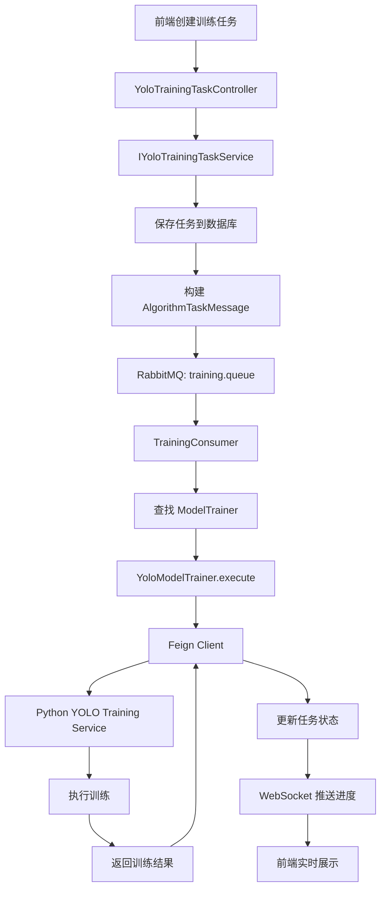
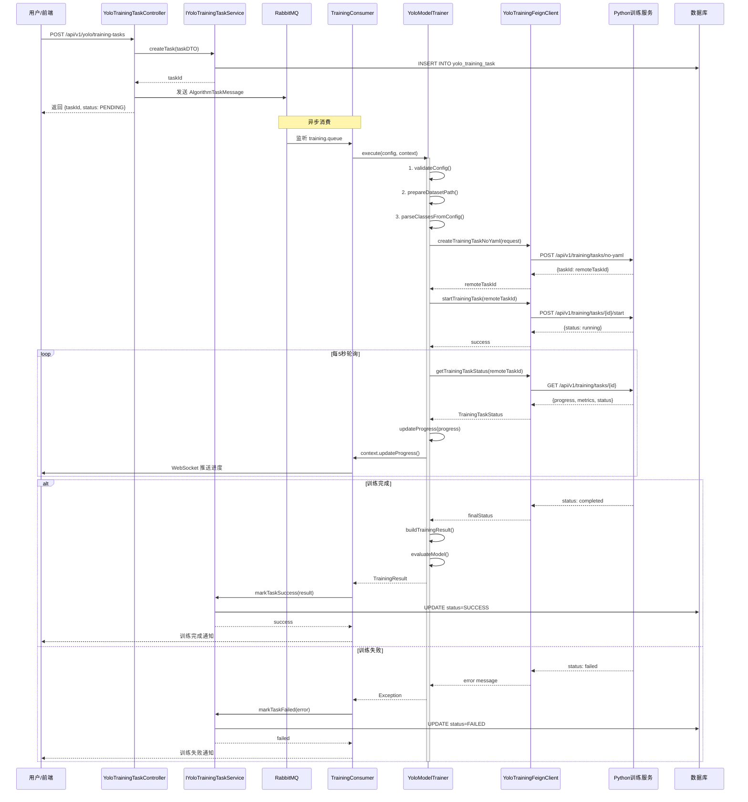
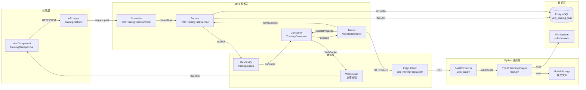
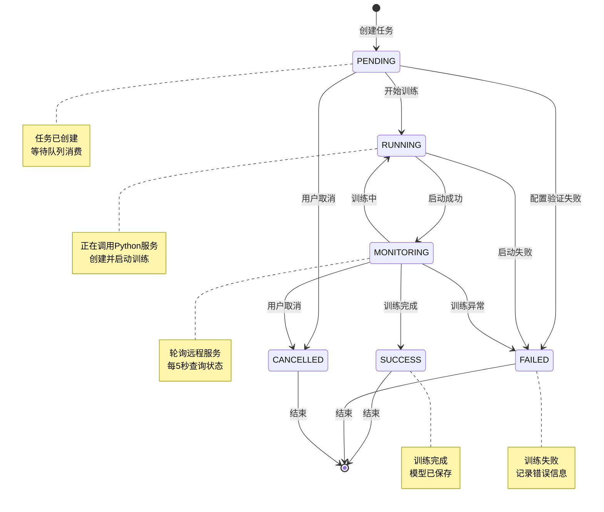
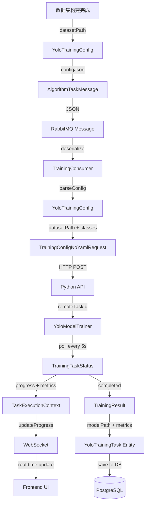
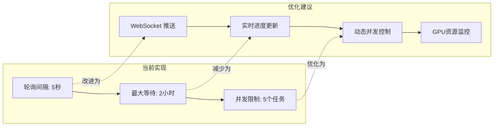

# YOLO 训练任务完整流程图

## 📊 整体架构流程

```mermaid
graph TB
    A[前端创建训练任务] --> B[YoloTrainingTaskController]
    B --> C[IYoloTrainingTaskService]
    C --> D[保存任务到数据库]
    D --> E[构建 AlgorithmTaskMessage]
    E --> F[RabbitMQ: training.queue]
    F --> G[TrainingConsumer]
    G --> H[查找 ModelTrainer]
    H --> I[YoloModelTrainer.execute]
    I --> J[Feign Client]
    J --> K[Python YOLO Training Service]
    K --> L[执行训练]
    L --> M[返回训练结果]
    M --> J
    J --> N[更新任务状态]
    N --> O[WebSocket 推送进度]
    O --> P[前端实时展示]
```

## 🔄 详细训练流程

```mermaid
sequenceDiagram
    participant U as 用户/前端
    participant C as YoloTrainingTaskController
    participant S as IYoloTrainingTaskService
    participant Q as RabbitMQ
    participant Consumer as TrainingConsumer
    participant Trainer as YoloModelTrainer
    participant Feign as YoloTrainingFeignClient
    participant Python as Python训练服务
    participant DB as 数据库

    U->>C: POST /api/v1/yolo/training-tasks
    C->>S: createTask(taskDTO)
    S->>DB: INSERT INTO yolo_training_task
    S-->>C: taskId
    C->>Q: 发送 AlgorithmTaskMessage
    C-->>U: 返回 {taskId, status: PENDING}
    
    Note over Q,Consumer: 异步消费
    
    Q->>Consumer: 监听 training.queue
    Consumer->>Trainer: execute(config, context)
    
    activate Trainer
    Trainer->>Trainer: 1. validateConfig()
    Trainer->>Trainer: 2. prepareDatasetPath()
    Trainer->>Trainer: 3. parseClassesFromConfig()
    
    Trainer->>Feign: createTrainingTaskNoYaml(request)
    Feign->>Python: POST /api/v1/training/tasks/no-yaml
    Python-->>Feign: {taskId: remoteTaskId}
    Feign-->>Trainer: remoteTaskId
    
    Trainer->>Feign: startTrainingTask(remoteTaskId)
    Feign->>Python: POST /api/v1/training/tasks/{id}/start
    Python-->>Feign: {status: running}
    Feign-->>Trainer: success
    
    loop 每5秒轮询
        Trainer->>Feign: getTrainingTaskStatus(remoteTaskId)
        Feign->>Python: GET /api/v1/training/tasks/{id}
        Python-->>Feign: {progress, metrics, status}
        Feign-->>Trainer: TrainingTaskStatus
        Trainer->>Trainer: updateProgress(progress)
        Trainer->>Consumer: context.updateProgress()
        Consumer->>U: WebSocket 推送进度
    end
    
    alt 训练完成
        Python-->>Feign: status: completed
        Feign-->>Trainer: finalStatus
        Trainer->>Trainer: buildTrainingResult()
        Trainer->>Trainer: evaluateModel()
        Trainer-->>Consumer: TrainingResult
        Consumer->>S: markTaskSuccess(result)
        S->>DB: UPDATE status=SUCCESS
        S-->>Consumer: success
        Consumer-->>U: 训练完成通知
    else 训练失败
        Python-->>Feign: status: failed
        Feign-->>Trainer: error message
        Trainer-->>Consumer: Exception
        Consumer->>S: markTaskFailed(error)
        S->>DB: UPDATE status=FAILED
        S-->>Consumer: failed
        Consumer-->>U: 训练失败通知
    end
    deactivate Trainer
```

## 🏗️ 组件交互图

```mermaid
graph LR
    subgraph "前端层"
        A[Vue Component<br/>TrainingManager.vue]
        B[API Layer<br/>training-tasks.ts]
    end
    
    subgraph "Java 服务层"
        C[Controller<br/>YoloTrainingTaskController]
        D[Service<br/>IYoloTrainingTaskService]
        E[Consumer<br/>TrainingConsumer]
        F[Trainer<br/>YoloModelTrainer]
    end
    
    subgraph "通信层"
        G[RabbitMQ<br/>training.queue]
        H[Feign Client<br/>YoloTrainingFeignClient]
        I[WebSocket<br/>进度推送]
    end
    
    subgraph "Python 服务层"
        J[FastAPI Server<br/>yolo_api.py]
        K[YOLO Training Engine<br/>train.py]
        L[Model Storage<br/>模型文件]
    end
    
    subgraph "数据层"
        M[(PostgreSQL<br/>yolo_training_task)]
        N[File System<br/>yolo-datasets]
    end
    
    A -->|HTTP POST| B
    B -->|request.post| C
    C -->|createTask| D
    D -->|INSERT| M
    D -->|publish| G
    G -->|consume| E
    E -->|execute| F
    F -->|HTTP REST| H
    H -->|HTTP| J
    J -->|subprocess| K
    K -->|save| L
    K -->|read| N
    F -->|updateProgress| E
    E -->|WebSocket| I
    I -->|real-time| A
    F -->|markSuccess| D
    D -->|UPDATE| M
```

## 📈 状态流转图

```mermaid
stateDiagram-v2
    [*] --> PENDING: 创建任务
    
    PENDING --> RUNNING: 开始训练
    PENDING --> FAILED: 配置验证失败
    PENDING --> CANCELLED: 用户取消
    
    RUNNING --> MONITORING: 启动成功
    RUNNING --> FAILED: 启动失败
    
    MONITORING --> RUNNING: 训练中
    MONITORING --> SUCCESS: 训练完成
    MONITORING --> FAILED: 训练异常
    MONITORING --> CANCELLED: 用户取消
    
    SUCCESS --> [*]: 结束
    FAILED --> [*]: 结束
    CANCELLED --> [*]: 结束
    
    note right of PENDING
        任务已创建
        等待队列消费
    end note
    
    note right of RUNNING
        正在调用Python服务
        创建并启动训练
    end note
    
    note right of MONITORING
        轮询远程服务
        每5秒查询状态
    end note
    
    note right of SUCCESS
        训练完成
        模型已保存
    end note
    
    note right of FAILED
        训练失败
        记录错误信息
    end note
```

## 🔍 数据流图

```mermaid
graph TD
    A[数据集构建完成] -->|datasetPath| B[YoloTrainingConfig]
    B -->|configJson| C[AlgorithmTaskMessage]
    C -->|JSON| D[RabbitMQ Message]
    D -->|deserialize| E[TrainingConsumer]
    E -->|parseConfig| F[YoloTrainingConfig]
    F -->|datasetPath + classes| G[TrainingConfigNoYamlRequest]
    G -->|HTTP POST| H[Python API]
    H -->|remoteTaskId| I[YoloModelTrainer]
    I -->|poll every 5s| J[TrainingTaskStatus]
    J -->|progress + metrics| K[TaskExecutionContext]
    K -->|updateProgress| L[WebSocket]
    L -->|real-time update| M[Frontend UI]
    J -->|completed| N[TrainingResult]
    N -->|modelPath + metrics| O[YoloTrainingTask Entity]
    O -->|save to DB| P[(PostgreSQL)]
```

## ⚡ 性能优化点

```mermaid
graph LR
    subgraph "当前实现"
        A1[轮询间隔: 5秒] --> B1[最大等待: 2小时]
        B1 --> C1[并发限制: 5个任务]
    end
    
    subgraph "优化建议"
        A2[WebSocket 推送] --> B2[实时进度更新]
        B2 --> C2[动态并发控制]
        C2 --> D2[GPU资源监控]
    end
    
    A1 -.->|改进为| A2
    B1 -.->|减少为| B2
    C1 -.->|优化为| C2
```

---

**文档生成时间**: 2026-05-14  
**适用版本**: jnet-algorithm-parent 1.0.0
