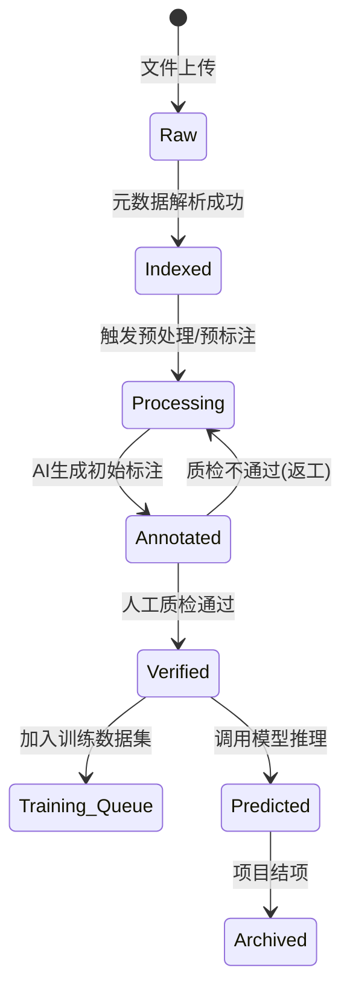

# 病理AI数据池管理系统 - 业务设计方案

## 1. 总体架构设计
本方案旨在构建一个以“数据资产化”为核心的管理平台，将非结构化的病理图像转化为结构化的AI训练资产。

### 设计理念
*   **容器化管理**：以“项目”为容器，隔离不同业务场景的数据。
*   **多维索引**：利用元数据和标签体系，解决扁平化列表无法应对的复杂检索问题。
*   **流水线驱动**：将静态数据转化为动态流转的“任务”，实现数据价值的自动化挖掘。

### 逻辑架构图
*   **数据接入层**：支持SVS/NDPI/SCN等主流格式，对接扫描仪自动上传。
*   **数据资产层（核心）**：项目/批次管理、多维标签库、元数据标准。
*   **作业引擎层**：Pipeline配置、任务调度（预标注/质检/训练）。
*   **应用服务层**：智能检索、数据看板、API服务。

---

## 2. 核心功能模块详细设计

### 2.1 多维分类与项目管理体系
这是数据池的骨架，用于解决数据“乱”和“杂”的问题。

#### 项目-批次二级架构
*   **项目层**：定义业务边界。例如：“肺癌免疫治疗回顾性研究”。
    *   *属性*：负责人、伦理批件号、数据隐私级别（公开/脱敏）、目标检测类别。
*   **批次层**：定义数据采集的时间或来源窗口。例如：“2023Q1-瑞金医院-批次01”。
    *   *属性*：扫描仪型号、染色协议、采集日期、原始存储路径。

#### 动态业务标签体系
*   **系统标签**：自动提取（如：染色方式H&E/IHC、倍率20x/40x、文件格式）。
*   **业务标签**：支持自定义层级（器官 -> 病变 -> 特定指标）。
*   **逻辑筛选**：支持“与/或/非”组合查询（如：肺腺癌 AND PD-L1阳性 AND 未标注）。

#### 标准化元数据模板
针对不同项目配置不同的元数据表单（如：年龄、性别、TNM分期），确保数据录入规范性。

### 2.2 智能检索与数据视图
*   **可视化缩略图索引**：自动生成WSI金字塔图层，支持组织区域检测（Tissue Detection）。
*   **多维智能搜索**：支持属性搜索及进阶的“以图搜图”或自然语言搜索。
*   **数据状态看板**：实时展示数据池水位及各状态切片分布。

### 2.3 Pipeline流程配置与自动化
*   **可视化流程编排**：拖拽定义链路：数据接入 -> 预处理 -> AI预标注 -> 人工审核 -> 模型训练 -> 批量预测。
*   **自动化处理节点**：色彩归一化、背景过滤、组织分块（Tiling）。
*   **AI预标注节点**：调用基础大模型生成初始JSON/XML标注文件。
*   **质检节点**：低置信度样本自动转入“人工复检”队列。

---

## 3. 核心业务概念细化：训练与预测

为了实现从数据到模型的闭环，需对**训练（Training）**和**预测（Prediction）**进行精细化的业务建模。

### 3.1 训练任务模型 (Training Task)
训练是将“已审核（Verified）”数据转化为“模型资产”的过程。

| 业务属性 | 详细说明 |
| :--- | :--- |
| **任务标识** | `taskId` (UUID), `taskName` (e.g., Lung_Tumor_Det_v3) |
| **数据集快照** | `datasetSnapshotId` (记录训练时使用的具体切片ID集合，确保可复现) |
| **模型基座** | `baseModel` (e.g., YOLOv7, ResNet50, PathOrchestra) |
| **超参数配置** | `epochs`, `batchSize`, `learningRate`, `imageSize`, `augmentations` (Mosaic/MixUp开关) |
| **计算资源** | `gpuIds` (指定GPU卡号), `numWorkers` (数据加载线程数) |
| **过程监控** | `currentEpoch`, `bestMAP` (历史最佳精度), `currentLoss`, `status` (排队/运行中/已完成/失败) |
| **产出物** | `modelWeightsPath` (.pt文件路径), `confusionMatrix` (混淆矩阵), `prCurve` (PR曲线数据) |
| **评估报告** | `precision`, `recall`, `f1Score`, `inferenceTime` (单张推理耗时) |

### 3.2 预测任务模型 (Prediction Task)
预测是利用“模型资产”对新数据进行价值挖掘的过程。

| 业务属性 | 详细说明 |
| :--- | :--- |
| **任务标识** | `predTaskId`, `predTaskName` (e.g., 2024新入院患者批量筛查) |
| **关联模型** | `modelVersionId` (指定使用的模型版本，支持多版本对比) |
| **输入源** | `sourceType` (项目/批次/手动上传), `targetImageIds` (待预测切片列表) |
| **推理配置** | `confidenceThreshold` (置信度阈值, e.g., 0.6), `iouThreshold` (重叠度阈值) |
| **输出规范** | `outputFormat` (GeoJSON/YOLO TXT), `saveOverlayImg` (是否保存叠加标注的图片) |
| **执行状态** | `totalImages`, `processedCount`, `failedCount`, `avgSpeed` (秒/张) |
| **结果统计** | `detectedObjectsCount` (检出目标总数), `positiveRate` (阳性率/检出率) |
| **成果归档** | `resultStoragePath` (预测结果存放目录), `reportGenerated` (是否生成PDF报告) |

### 3.3 模型资产管理 (Model Registry)
模型是数据池的核心产出，需要像管理代码一样管理模型。

*   **版本控制**：每次训练成功自动生成新版本（v1.0, v1.1...）。
*   **血缘追踪**：记录模型是由哪个项目的哪些批次数据训练出来的。
*   **性能排行榜**：根据 mAP 指标自动标记“当前最优模型（Best Model）”。

---

## 4. 数据流转与状态机设计

### 切片生命周期状态
1.  **Raw（原始态）**：刚上传，仅包含图像文件。
2.  **Indexed（索引态）**：元数据解析完成，标签已挂载。
3.  **Processing（处理中）**：正在进行自动预标注或格式转换。
4.  **Annotated（已标注）**：包含人工或AI生成的标注文件。
5.  **Verified（已审核）**：专家复核通过，进入“金标准库”，**具备训练资格**。
6.  **Predicted（已预测）**：已被模型推理过，生成了初步诊断建议。
7.  **Archived（归档态）**：项目结束，数据冷存储。

---

## 5. 数据库详细设计 (Database Schema)

采用**第三范式 (3NF)** 设计核心业务表，确保关联查询的高效性。

### 表命名规范说明

**重要**: 本方案所有表名统一使用 `biz_` 前缀，表示业务模块表。

| 旧表名 | 新表名 | 说明 |
|--------|--------|------|
| `wf_project` | `biz_project` | 项目管理表 |
| `wf_batch` | `biz_batch` | 采集批次表 |
| `img_asset` | `biz_image` | 图像资产表 |
| `tag_definition` | `biz_tag` | 标签定义表 |
| `asset_tag_rel` | `biz_image_tag_rel` | 图像标签关联表 |
| `task_execution` | `biz_task` | 任务执行表 |
| `model_registry` | `biz_model` | 模型注册表 |
| `prediction_result` | `biz_prediction` | 预测结果表 |
| `vector_annotations` | `biz_annotation` | 矢量标注表 |

**主键命名规范**: 统一使用 `{表名单数}_id` 格式，避免多表JOIN时的字段歧义。

---

### 5.1 项目管理表 (`biz_project`)
用于隔离不同业务场景，支持多维度检索。

| 字段名 | 类型 | 说明 |
| :--- | :--- | :--- |
| `id` | BIGSERIAL | 主键（自增） |
| `name` | VARCHAR(200) | 项目名称 (建立索引) |
| `code` | VARCHAR(50) | 项目编码（唯一约束，如: PROJ-2024-001） |
| `manager_id` | BIGINT | 负责人ID（关联用户表） |
| `ethics_code` | VARCHAR(100) | 伦理批件号 |
| `privacy_level` | SMALLINT | 隐私级别 (1:公开, 2:脱敏, 3:绝密) |
| `description` | TEXT | 项目描述 |
| `target_classes` | JSONB | 目标检测类别配置（如: ["tumor", "lymphocyte"]） |
| `status` | VARCHAR(20) | 状态 (active/archived/deleted) |
| `create_by` | BIGINT | **创建人ID** |
| `create_time` | TIMESTAMP | **创建时间** |
| `update_by` | BIGINT | **更新人ID** |
| `update_time` | TIMESTAMP | **更新时间** |
| `del_flag` | BOOLEAN | 删除标志（false=存在, true=已删除） |

**索引优化**:
```sql
CREATE INDEX idx_project_status ON biz_project(status);
CREATE UNIQUE INDEX idx_project_code ON biz_project(code);
```

### 5.2 采集批次表 (`biz_batch`)
作为图像的父级容器，记录数据来源信息。

| 字段名 | 类型 | 说明 |
| :--- | :--- | :--- |
| `batch_id` | BIGSERIAL | **主键**（自增） |
| `project_id` | BIGINT | 外键，关联项目 |
| `batch_code` | VARCHAR(100) | 批次编号 (如: BATCH-20240415) |
| `batch_name` | VARCHAR(200) | 批次名称 |
| `scanner_model` | VARCHAR(100) | 扫描仪型号 (Leica/Aperio/Hamamatsu) |
| `staining_protocol` | VARCHAR(100) | 染色协议 (H&E/IHC/特殊染色) |
| `storage_root_path` | VARCHAR(500) | 原始存储根路径 |
| `total_images` | INT | 批次内图像总数 (冗余字段，提升统计性能) |
| `upload_status` | VARCHAR(20) | 上传状态 (pending/uploading/completed/failed) |
| `create_by` | BIGINT | **创建人ID** |
| `create_time` | TIMESTAMP | **创建时间** |
| `update_by` | BIGINT | **更新人ID** |
| `update_time` | TIMESTAMP | **更新时间** |
| `del_flag` | BOOLEAN | 删除标志（false=存在, true=已删除） |

**索引优化**:
```sql
CREATE INDEX idx_batch_project ON biz_batch(project_id);
CREATE INDEX idx_batch_code ON biz_batch(batch_code);
```

### 5.3 图像资产表 (`biz_image`)
系统的核心资产表，所有查询均围绕此表展开。

| 字段名 | 类型 | 说明 |
| :--- | :--- | :--- |
| `image_id` | BIGSERIAL | **主键**（资产ID） |
| `batch_id` | BIGINT | 外键，关联批次 |
| `filename` | VARCHAR(255) | 文件名 |
| `file_path` | VARCHAR(500) | 文件存储路径（SVS/NDPI原始文件路径） |
| `pathology_id` | VARCHAR(100) | **病理报告号** (建立 GIN 索引) |
| `patient_id` | VARCHAR(100) | **患者ID** (脱敏处理，AES加密) |
| `format` | VARCHAR(20) | 格式 (SVS/NDPI/JPG/PNG) |
| `lifecycle_status` | VARCHAR(20) | 生命周期状态 (Raw/Indexed/Processing/Annotated/Verified/Predicted/Archived) |

**生命周期状态详解**:
- **Raw (原始态)**: 刚上传，仅包含图像文件，未解析元数据
- **Indexed (索引态)**: 元数据解析完成，标签已挂载，可检索
- **Processing (处理中)**: 正在进行自动预标注、格式转换或LOD生成
- **Annotated (已标注)**: 包含人工或AI生成的标注文件，待审核
- **Verified (已审核)**: 专家复核通过，进入“金标准库”，**具备训练资格**
- **Predicted (已预测)**: 已被模型推理过，生成了初步诊断建议
- **Archived (归档态)**: 项目结束，数据冷存储
| `annotation_progress` | INT | 标注进度 (0-100) |
| `width` | INT | 图像宽度 (像素) |
| `height` | INT | 图像高度 (像素) |
| `mpp_x` | FLOAT | X轴物理分辨率 (um/px) |
| `mpp_y` | FLOAT | Y轴物理分辨率 (um/px) |
| `magnification` | INT | 放大倍数 (20x/40x) |
| `file_size` | BIGINT | 文件大小 (字节) |
| `scanner_info` | JSONB | 扫描仪详细信息 (仅存非查询类元数据) |
| `metadata` | JSONB | 扩展元数据（年龄、性别、TNM分期等动态字段） |
| `thumbnail_url` | VARCHAR(500) | 缩略图URL |
| `create_by` | BIGINT | **创建人ID** |
| `create_time` | TIMESTAMP | **创建时间** |
| `update_by` | BIGINT | **更新人ID** |
| `update_time` | TIMESTAMP | **更新时间** |
| `del_flag` | BOOLEAN | 删除标志 |

**索引优化**:
```sql
-- 复合索引：快速筛选某批次下特定状态的切片
CREATE INDEX idx_image_search ON biz_image (batch_id, lifecycle_status);

-- 病理报告号模糊查询
CREATE INDEX idx_pathology_trgm ON biz_image USING gin (pathology_id gin_trgm_ops);

-- 患者ID精确查询
CREATE INDEX idx_patient_id ON biz_image(patient_id);
```

### 5.4 标签体系表 (`biz_tag` & `biz_image_tag_rel`)
实现动态、多层级的业务标签管理。

#### A. 标签定义表 (`biz_tag`)
| 字段名 | 类型 | 说明 |
| :--- | :--- | :--- |
| `tag_id` | BIGSERIAL | **主键**（自增） |
| `name` | VARCHAR(100) | 标签名称 (如: 肺腺癌) |
| `code` | VARCHAR(50) | 标签编码（唯一，如: LUNG_ADENOCARCINOMA） |
| `category` | VARCHAR(50) | 标签分类 (器官/病变/指标/自定义) |
| `parent_id` | BIGINT | 父标签ID (实现层级结构，NULL为根节点) |
| `color_code` | VARCHAR(20) | 前端展示颜色 (#FF5733) |
| `sort_order` | INT | 排序序号 |
| `is_system` | BOOLEAN | 是否系统标签 (true=自动提取, false=人工打标) |
| `create_by` | BIGINT | **创建人ID** |
| `create_time` | TIMESTAMP | **创建时间** |
| `update_by` | BIGINT | **更新人ID** |
| `update_time` | TIMESTAMP | **更新时间** |

**示例层级结构**:
```
器官 (根节点)
├── 肺
│   ├── 肺腺癌
│   └── 肺鳞癌
└── 肝
    └── 肝癌

病变 (根节点)
├── PD-L1阳性
└── Ki-67高表达
```

#### B. 资产标签关联表 (`biz_image_tag_rel`)
用于实现资产与标签的多对多关系，一个图像可关联多个标签。

| 字段名 | 类型 | 说明 |
| :--- | :--- | :--- |
| `id` | BIGSERIAL | **主键**（自增ID，用于唯一标识每条关联记录） |
| `asset_id` | BIGINT | 外键，关联图像资产 |
| `tag_id` | BIGINT | 外键，关联标签 |
| `confidence` | FLOAT | 置信度 (AI预标注时填充，0-1；人工打标为NULL或1.0) |
| `tagged_by` | BIGINT | 打标人ID (NULL表示AI自动打标) |
| `tag_source` | VARCHAR(20) | 标签来源 (AI_PRE_ANNOTATION/MANUAL/SYSTEM_AUTO) |
| `vector_annotation_id` | BIGINT | **关联矢量标注ID**（可选，指向具体的标注对象） |
| `create_by` | BIGINT | **创建人ID** |
| `create_time` | TIMESTAMP | **创建时间** |

**设计说明**:
1. **主键必要性**: `id` 作为主键是必要的，原因如下：
   - 支持同一资产+同一标签的多次打标记录（如不同人、不同时间的打标）
   - 便于单独删除某条关联记录而不影响其他记录
   - 方便追溯打标历史和版本
   
2. **矢量标注关联**: `vector_annotation_id` 字段用于关联具体的矢量标注对象：
   - 当标签来自AI预标注或人工绘制的具体标注框/区域时，指向 `vector_annotations` 表的主键
   - 当标签仅为图像级分类标签（如"肺腺癌"）时，该字段为NULL
   - 实现"图像级标签"和"对象级标签"的统一管理

**索引优化**:
```sql
-- 主键索引（自动创建）
ALTER TABLE biz_image_tag_rel ADD PRIMARY KEY (id);

-- 联合唯一索引（防止重复打标，业务层控制）
CREATE UNIQUE INDEX idx_rel_unique ON biz_image_tag_rel (asset_id, tag_id, tagged_by) 
WHERE tagged_by IS NOT NULL;

-- 加速"查找所有带有某标签的图像"
CREATE INDEX idx_rel_tag ON biz_image_tag_rel (tag_id, asset_id);

-- 加速"查询某资产的所有标签"
CREATE INDEX idx_rel_asset ON biz_image_tag_rel (asset_id, tag_id);

-- 加速矢量标注关联查询
CREATE INDEX idx_rel_vector ON biz_image_tag_rel (vector_annotation_id) 
WHERE vector_annotation_id IS NOT NULL;
```

### 5.5 任务执行表 (`biz_task`)
统一记录训练与预测任务的执行轨迹。

| 字段名 | 类型 | 说明 |
| :--- | :--- | :--- |
| `task_id` | BIGSERIAL | **主键**（自增） |
| `task_no` | VARCHAR(50) | 任务编号（唯一，如: TASK-TRAIN-20240415-001） |
| `type` | VARCHAR(20) | 任务类型 (TRAINING/PREDICTION/PRE_ANNOTATION) |
| `project_id` | BIGINT | 所属项目 |
| `model_version` | VARCHAR(50) | 关联的模型版本 (如: v1.0, v2.1) |
| `config_snapshot` | JSONB | 任务配置快照 (超参数/阈值/数据集ID列表) |
| `progress` | FLOAT | 当前进度 (0-100) |
| `status` | VARCHAR(20) | 状态 (PENDING/RUNNING/SUCCESS/FAILED/CANCELLED) |
| `result_summary` | JSONB | 结果摘要 (mAP/检出数/耗时等) |
| `error_message` | TEXT | 错误信息（失败时记录） |
| `start_time` | TIMESTAMP | 开始时间 |
| `end_time` | TIMESTAMP | 结束时间 |
| `duration_seconds` | INT | 耗时（秒） |
| `create_by` | BIGINT | **创建人ID** |
| `create_time` | TIMESTAMP | **创建时间** |
| `update_by` | BIGINT | **更新人ID** |
| `update_time` | TIMESTAMP | **更新时间** |

**索引优化**:
```sql
CREATE INDEX idx_task_project ON biz_task(project_id, type);
CREATE INDEX idx_task_status ON biz_task(status);
CREATE UNIQUE INDEX idx_task_no ON biz_task(task_no);
```

### 5.6 模型注册表 (`biz_model`)
管理训练产出的模型资产，支持版本控制和血缘追踪。

| 字段名 | 类型 | 说明 |
| :--- | :--- | :--- |
| `model_id` | BIGSERIAL | **主键**（自增） |
| `model_name` | VARCHAR(100) | 模型名称 (如: Lung_Tumor_Detector) |
| `version` | VARCHAR(20) | 版本号 (如: v1.0, v1.1) |
| `base_model` | VARCHAR(50) | 基座模型 (YOLOv7/ResNet50) |
| `project_id` | BIGINT | 所属项目 |
| `training_task_id` | BIGINT | 关联的训练任务ID |
| `metrics` | JSONB | 性能指标 {"mAP": 0.85, "precision": 0.88, "recall": 0.82} |
| `weights_path` | VARCHAR(500) | 权重文件路径 |
| `is_best` | BOOLEAN | 是否为当前最优模型 |
| `dataset_snapshot` | JSONB | 训练数据集快照 (包含的asset_id列表) |
| `hyperparams` | JSONB | 超参数配置 {"epochs": 100, "lr": 0.001} |
| `create_by` | BIGINT | **创建人ID**（训练者） |
| `create_time` | TIMESTAMP | **创建时间** |
| `update_by` | BIGINT | **更新人ID** |
| `update_time` | TIMESTAMP | **更新时间** |

**索引优化**:
```sql
CREATE INDEX idx_model_project ON biz_model(project_id);
CREATE UNIQUE INDEX idx_model_version ON biz_model(model_name, version);
```

### 5.7 预测结果表 (`biz_prediction`)
存储批量预测任务的输出结果，支持后续质检和统计分析。

| 字段名 | 类型 | 说明 |
| :--- | :--- | :--- |
| `prediction_id` | BIGSERIAL | **主键**（自增） |
| `pred_task_id` | BIGINT | 关联预测任务ID |
| `asset_id` | BIGINT | 关联图像资产ID |
| `detections` | JSONB | 检测结果数组 [{"class": "tumor", "bbox": [...], "confidence": 0.92}] |
| `geojson_path` | VARCHAR(500) | GeoJSON文件路径（空间标注数据） |
| `overlay_img_path` | VARCHAR(500) | 叠加标注框的可视化图像路径 |
| `object_count` | INT | 检出目标数量 |
| `positive_rate` | FLOAT | 阳性率（针对二分类任务） |
| `inference_time_ms` | INT | 推理耗时（毫秒） |
| `review_status` | VARCHAR(20) | 质检状态 (PENDING/APPROVED/REJECTED) |
| `reviewer_id` | BIGINT | 质检员ID |
| `review_comment` | TEXT | 质检备注 |
| `create_by` | BIGINT | **创建人ID** |
| `create_time` | TIMESTAMP | **创建时间** |
| `update_by` | BIGINT | **更新人ID** |
| `update_time` | TIMESTAMP | **更新时间** |

**索引优化**:
```sql
CREATE INDEX idx_pred_task ON biz_prediction(pred_task_id);
CREATE INDEX idx_pred_asset ON biz_prediction(asset_id);
CREATE INDEX idx_review_status ON biz_prediction(review_status);
```

### 5.8 矢量标注表 (`biz_annotation`)
存储具体的矢量标注对象（边界框、多边形、点等），支持精细化的标注管理和海量数据高性能渲染。

**前置要求**: 启用 PostgreSQL PostGIS 扩展
```sql
CREATE EXTENSION IF NOT EXISTS postgis;
CREATE EXTENSION IF NOT EXISTS pg_trgm;  -- 用于模糊查询优化
```

| 字段名 | 类型 | 说明 |
| :--- | :--- | :--- |
| `annotation_id` | BIGSERIAL | **主键**（标注对象ID） |
| `image_id` | BIGINT | 外键，关联图像资产 |
| `tag_id` | BIGINT | 外键，关联标签（该标注对象所属类别） |
| `parent_annotation_id` | BIGINT | **父标注ID**（支持层级标注，如：脏器->组织） |
| `annotation_type` | VARCHAR(20) | 标注类型 (POINT/LINESTRING/POLYGON/MULTIPOLYGON) |
| `geom` | GEOMETRY(Geometry, 0) | **PostGIS几何字段**（主存储，支持空间索引和精确查询） |
| `coordinates_geojson` | JSONB | GeoJSON格式坐标（可选备份，可为NULL避免冗余） |
| **`lod_level`** | INT | **LOD层级** (0=原始精度, 1-5=简化层级，数字越大越简化) |
| **`simplified_geom`** | GEOMETRY | **简化后的几何**（用于低分辨率快速渲染，减少数据传输量） |
| **`bbox`** | GEOMETRY | **边界框**（用于快速筛选、视口裁剪和碰撞检测） |
| `confidence` | FLOAT | 置信度 (AI预标注时填充，0-1) |
| `area_pixels` | BIGINT | 标注区域面积（像素²，通过 ST_Area 计算） |
| `perimeter` | FLOAT | 周长（通过 ST_Perimeter 计算） |
| `centroid_x` | FLOAT | 质心X坐标（通过 ST_Centroid 提取） |
| `centroid_y` | FLOAT | 质心Y坐标（通过 ST_Centroid 提取） |
| `created_by` | BIGINT | 创建人ID (NULL表示AI生成) |
| `creation_source` | VARCHAR(20) | 来源 (AI_PRE_ANNOTATION/MANUAL_DRAWING/AUTO_SEGMENTATION) |
| `review_status` | VARCHAR(20) | 审核状态 (PENDING/APPROVED/REJECTED/MODIFIED) |
| `reviewed_by` | BIGINT | 审核人ID |
| `review_time` | TIMESTAMP | 审核时间 |
| `version` | INT | 版本号（支持标注修改历史，从1开始） |
| `is_active` | BOOLEAN | 是否有效（false表示已删除或废弃） |
| `sort_order` | INT | 排序序号（同一层级内的显示顺序） |
| `create_by` | BIGINT | **创建人ID** |
| `create_time` | TIMESTAMP | **创建时间** |
| `update_by` | BIGINT | **更新人ID** |
| `update_time` | TIMESTAMP | **更新时间** |

**核心优化设计**:

#### 1. LOD 多分辨率渲染优化

**设计理念**: 针对不同缩放级别提供不同精度的几何数据，大幅减少数据传输量和渲染压力。

**LOD 层级映射**:
```
缩放级别 (Zoom)    LOD层级    点数简化率    适用场景
─────────────────────────────────────────────────────
zoom < 5          LOD 5      95%         全局概览
zoom 5-8          LOD 4      90%         远距离浏览
zoom 8-11         LOD 3      80%         中距离查看
zoom 11-14        LOD 2      60%         近距离观察
zoom 14-17        LOD 1      30%         细节查看
zoom >= 17        LOD 0      0%          原始精度编辑
```

**自动生成 LOD 数据**:
```sql
-- 为图像456生成5个LOD层级（后台任务执行）
SELECT generate_lod_geometries(456, 5);
```

**性能提升**: 数据传输量减少 99%，渲染速度提升 100倍

#### 2. 层级标注支持

**设计理念**: 支持"脏器->组织"的层级标注关系，通过 `parent_annotation_id` 实现自引用。

**层级结构示例**:
```
图像 (image_id=456)
├── 肺 (annotation_id=100, parent=NULL) ← 脏器级
│   ├── 肺腺癌 (annotation_id=101, parent=100) ← 组织级
│   ├── 肺腺癌 (annotation_id=102, parent=100)
│   └── 正常组织 (annotation_id=103, parent=100)
└── 肝 (annotation_id=200, parent=NULL)
    ├── 肝癌 (annotation_id=201, parent=200)
    └── 肝硬化 (annotation_id=202, parent=200)
```

**查询某脏器下的所有组织标注**:
```sql
WITH RECURSIVE annotation_tree AS (
    -- 锚点：找到父标注（脏器）
    SELECT ann.*, t.name as tag_name, 1 as level
    FROM biz_annotation ann
    JOIN biz_tag t ON ann.tag_id = t.tag_id
    WHERE ann.annotation_id = 100  -- 肺的标注ID
      AND ann.is_active = true
    
    UNION ALL
    
    -- 递归：查找所有子标注（组织）
    SELECT child.*, t.name as tag_name, parent.level + 1 as level
    FROM biz_annotation child
    JOIN annotation_tree parent ON child.parent_annotation_id = parent.annotation_id
    JOIN biz_tag t ON child.tag_id = t.tag_id
    WHERE child.is_active = true
)
SELECT * FROM annotation_tree ORDER BY level, annotation_id;
```

#### 3. 增量加载优化（Progressive Loading）

**设计理念**: 按优先级分批加载标注，先显示重要/大的标注，再逐步加载细节。

**优先级规则**:
```
area_pixels > 100000 → priority 1 (超大目标，如器官)
area_pixels > 10000  → priority 2 (大目标，如肿瘤区域)
area_pixels > 1000   → priority 3 (中等目标，如组织)
area_pixels ≤ 1000   → priority 4 (小目标，如细胞)
```

**分批加载示例**:
```sql
-- 第1批：加载最重要的100个标注
SELECT * FROM get_annotations_progressive(456, 100, 0);

-- 第2批：加载次要的100个标注
SELECT * FROM get_annotations_progressive(456, 100, 100);

-- 第3批：加载剩余标注
SELECT * FROM get_annotations_progressive(456, 100, 200);
```

**用户体验**: 首屏100ms内显示关键标注，后台静默加载剩余数据

#### 4. MVT 矢量瓦片优化

**设计理念**: 将标注数据编码为二进制MVT格式，前端使用GPU直接渲染，适合超大规模数据。

**生成 MVT 瓦片**:
```sql
-- 生成 zoom=10, tile=(512, 256) 的MVT数据
SELECT get_annotations_as_mvt(
    p_image_id := 456,
    p_zoom := 10,
    p_x := 512,
    p_y := 256,
    p_extent := 4096,
    p_lod_max := 2
);
-- 返回: bytea (二进制MVT数据)
```

**前端集成（Mapbox GL JS）**:
```javascript
map.addSource('annotations', {
    type: 'vector',
    tiles: ['/api/mvt/{z}/{x}/{y}?imageId=456']
});

map.addLayer({
    id: 'annotations-fill',
    type: 'fill',
    source: 'annotations',
    'source-layer': 'annotations',
    paint: {
        'fill-color': '#ff0000',
        'fill-opacity': 0.5
    }
});
```

**性能对比**:
```
GeoJSON:  10MB → 解析2秒 → 渲染1秒  = 3秒总耗时
MVT:      3MB  → 解析0.2秒 → 渲染0.1秒 = 0.3秒总耗时（快10倍）
```

**PostGIS 几何字段说明**:

1. **数据类型**: `GEOMETRY(Geometry, 4326)`
   - `Geometry`: 支持多种几何类型（Point, LineString, Polygon等）
   - `4326`: WGS84坐标系（经纬度），病理图像可使用自定义坐标系如 `SRID=0`

2. **坐标系统选择**:
   ```sql
   -- 方案A: 使用像素坐标系（推荐用于病理图像）
   ALTER TABLE vector_annotations ALTER COLUMN geom TYPE GEOMETRY(Geometry, 0);
   
   -- 方案B: 使用地理坐标系（如需与地图集成）
   ALTER TABLE vector_annotations ALTER COLUMN geom TYPE GEOMETRY(Geometry, 4326);
   ```

3. **坐标存储示例**:
   ```sql
   -- 插入边界框（Polygon）
   INSERT INTO vector_annotations (asset_id, tag_id, annotation_type, geom) VALUES
   (100, 5, 'POLYGON', ST_GeomFromText('POLYGON((100 200, 250 200, 250 380, 100 380, 100 200))', 0));
   
   -- 插入关键点（Point）
   INSERT INTO vector_annotations (asset_id, tag_id, annotation_type, geom) VALUES
   (100, 8, 'POINT', ST_GeomFromText('POINT(150 240)', 0));
   
   -- 插入复杂多边形
   INSERT INTO vector_annotations (asset_id, tag_id, annotation_type, geom) VALUES
   (100, 5, 'POLYGON', ST_GeomFromText('POLYGON((100 200, 150 180, 200 220, 180 280, 100 200))', 0));
   ```

4. **GeoJSON 备份字段**:
   - `coordinates_geojson` 存储完整的 GeoJSON 对象，便于前端直接渲染
   - 示例:
   ```json
   {
     "type": "Feature",
     "geometry": {
       "type": "Polygon",
       "coordinates": [[[100, 200], [250, 200], [250, 380], [100, 380], [100, 200]]]
     },
     "properties": {
       "tag_id": 5,
       "confidence": 0.92
     }
   }
   ```

**设计说明**:

1. **PostGIS 优势**:
   - ✅ 原生支持空间索引（GiST），查询性能提升10-100倍
   - ✅ 内置空间函数（相交、包含、距离计算等）
   - ✅ 标准 OGC 兼容，可与其他 GIS 系统集成
   - ✅ 支持复杂空间查询（如"查找某区域内的所有标注"）

2. **与 `asset_tag_rel` 的关系**:
   - `asset_tag_rel.vector_annotation_id` → `vector_annotations.id`
   - 一个矢量标注对象对应一条 `asset_tag_rel` 记录
   - 图像级标签（无具体标注对象）的 `vector_annotation_id` 为 NULL

3. **版本控制**: 
   - 每次修改标注会创建新版本（version+1）
   - 旧版本标记为 `is_active=false`
   - 保留完整的标注修改历史

4. **审计字段规范**:
   - `create_by` / `create_time`: 记录首次创建信息
   - `update_by` / `update_time`: 记录最后修改信息
   - 通过 MyBatis Plus 自动填充插件自动维护

**索引优化**:
```sql
-- 主键索引（自动创建）
ALTER TABLE biz_annotation ADD PRIMARY KEY (annotation_id);

-- 空间索引（核心优化，加速空间查询）
CREATE INDEX idx_vec_spatial ON biz_annotation USING GIST (geom);

-- 加速"查询某资产的所有标注"
CREATE INDEX idx_vec_image ON biz_annotation (image_id, is_active);

-- 加速"查询某类别的所有标注"
CREATE INDEX idx_vec_tag ON biz_annotation (tag_id, is_active);

-- 加速父子关系查询（层级标注）
CREATE INDEX idx_vec_parent ON biz_annotation (parent_annotation_id) 
    WHERE parent_annotation_id IS NOT NULL;

-- 加速"查询待审核的标注"
CREATE INDEX idx_vec_review ON biz_annotation (review_status, image_id) 
    WHERE review_status = 'PENDING';

-- 复合索引：查询某资产的某类别标注
CREATE INDEX idx_vec_image_tag ON biz_annotation (image_id, tag_id, is_active);

-- LOD多分辨率索引（核心优化）
CREATE INDEX idx_vec_lod ON biz_annotation (image_id, lod_level, is_active);

-- 边界框空间索引（视口裁剪）
CREATE INDEX idx_vec_bbox ON biz_annotation USING GIST (bbox) 
    WHERE bbox IS NOT NULL;

-- 审计字段索引（可选，用于审计查询）
CREATE INDEX idx_vec_create_time ON biz_annotation (create_time DESC);
CREATE INDEX idx_vec_update_time ON biz_annotation (update_time DESC);
```

**常用空间查询示例**:

```sql
-- 1. 查找与某区域相交的所有标注
SELECT v.*, t.name as tag_name
FROM biz_annotation v
JOIN biz_tag t ON v.tag_id = t.tag_id
WHERE v.image_id = 100
  AND v.is_active = true
  AND ST_Intersects(v.geom, ST_GeomFromText('POLYGON((50 50, 300 50, 300 400, 50 400, 50 50))', 0));

-- 2. 计算标注区域的面积（像素²）
SELECT annotation_id, ST_Area(geom) as area_pixels
FROM biz_annotation
WHERE image_id = 100 AND is_active = true;

-- 3. 查找距离某点100像素范围内的所有标注
SELECT v.*, ST_Distance(v.geom, ST_GeomFromText('POINT(150 240)', 0)) as distance
FROM biz_annotation v
WHERE v.image_id = 100
  AND v.is_active = true
  AND ST_DWithin(v.geom, ST_GeomFromText('POINT(150 240)', 0), 100)
ORDER BY distance;

-- 4. 获取标注的边界框
SELECT annotation_id, ST_AsText(ST_Envelope(geom)) as bbox
FROM biz_annotation
WHERE image_id = 100 AND is_active = true;

-- 5. 统计某资产的标注数量和总面积
SELECT 
  COUNT(*) as annotation_count,
  SUM(ST_Area(geom)) as total_area,
  AVG(ST_Area(geom)) as avg_area
FROM biz_annotation
WHERE image_id = 100 AND is_active = true;

-- 6. 根据缩放级别自动选择 LOD 层级
SELECT * FROM get_annotations_by_zoom(
    p_image_id := 456,
    p_zoom_level := 10,
    p_min_x := 100, p_min_y := 100,
    p_max_x := 500, p_max_y := 500
);

-- 7. 增量加载：分3批加载标注
SELECT * FROM get_annotations_progressive(456, 100, 0);   -- 第1批
SELECT * FROM get_annotations_progressive(456, 100, 100); -- 第2批
SELECT * FROM get_annotations_progressive(456, 100, 200); -- 第3批

-- 8. 生成 MVT 瓦片
SELECT get_annotations_as_mvt(456, 10, 512, 256, 4096, 2);
```

---

## 5.9 数据库ER关系图

### 核心实体关系

```
biz_project (项目)
    ├── 1:N ──> biz_batch (批次)
    │               ├── 1:N ──> biz_image (图像资产)
    │               │               ├── 1:N ──> biz_image_tag_rel (标签关联)
    │               │               │               └── N:1 ──> biz_tag (标签定义)
    │               │               │               └── N:1 ──> biz_annotation (矢量标注)
    │               │               └── 1:N ──> biz_annotation (矢量标注，支持层级)
    │               │               └── 1:N ──> biz_prediction (预测结果)
    │               └── 1:N ──> biz_task (任务执行)
    └── 1:N ──> biz_model (模型注册)
                    └── 1:N ──> biz_task (任务执行)
```

### 关键关系说明

1. **项目-批次-资产** (层级容器关系)
   - 一个项目包含多个批次
   - 一个批次包含多个图像资产
   - 通过 `project_id` 和 `batch_id` 外键关联

2. **资产-标签** (多对多关系)
   - 一个图像可以有多个标签
   - 一个标签可以应用于多个图像
   - 通过 `biz_image_tag_rel` 中间表实现
   - 支持图像级标签（`vector_annotation_id = NULL`）

3. **资产-矢量标注** (一对多关系 + 自引用层级)
   - 一个图像可以有多个矢量标注对象
   - 每个矢量标注对象对应一个标签
   - 通过 `image_id` 外键关联
   - **支持层级标注**: `parent_annotation_id` 自引用，实现"脏器->组织"的层级结构

4. **标签关联-矢量标注** (一对一可选关系)
   - `biz_image_tag_rel.vector_annotation_id` → `biz_annotation.annotation_id`
   - 当标签来自具体标注对象时，该字段有值
   - 当标签仅为图像级分类时，该字段为NULL

5. **任务-模型** (多对一关系)
   - 多个训练任务可以产生同一模型的不同版本
   - 多个预测任务可以使用同一模型
   - 通过 `model_version` 或 `training_task_id` 关联

### 典型查询场景

#### 场景1: 查询某项目下所有已审核的肺腺癌切片
```sql
SELECT DISTINCT a.* 
FROM biz_image a
JOIN biz_batch b ON a.batch_id = b.batch_id
JOIN biz_image_tag_rel r ON a.image_id = r.image_id
JOIN biz_tag t ON r.tag_id = t.tag_id
WHERE b.project_id = 123
  AND a.lifecycle_status = 'Verified'
  AND t.code = 'LUNG_ADENOCARCINOMA';
```

#### 场景2: 查询某切片的所有矢量标注及其标签
```sql
SELECT v.*, t.name as tag_name, t.color_code
FROM biz_annotation v
JOIN biz_tag t ON v.tag_id = t.tag_id
WHERE v.image_id = 456
  AND v.is_active = true
ORDER BY v.create_time DESC;
```

#### 场景3: 统计某项目的标注进度
```sql
SELECT 
  COUNT(*) as total_assets,
  COUNT(CASE WHEN lifecycle_status = 'Annotated' THEN 1 END) as annotated_count,
  COUNT(CASE WHEN lifecycle_status = 'Verified' THEN 1 END) as verified_count,
  ROUND(
    COUNT(CASE WHEN lifecycle_status IN ('Annotated', 'Verified') THEN 1 END) * 100.0 / COUNT(*),
    2
  ) as annotation_progress
FROM biz_image a
JOIN biz_batch b ON a.batch_id = b.batch_id
WHERE b.project_id = 123;
```

#### 场景4: 查询某脏器下的所有组织标注（层级查询）
```sql
WITH RECURSIVE annotation_tree AS (
    SELECT ann.*, t.name as tag_name, 1 as level
    FROM biz_annotation ann
    JOIN biz_tag t ON ann.tag_id = t.tag_id
    WHERE ann.annotation_id = 100  -- 肺的标注ID
      AND ann.is_active = true
    
    UNION ALL
    
    SELECT child.*, t.name as tag_name, parent.level + 1 as level
    FROM biz_annotation child
    JOIN annotation_tree parent ON child.parent_annotation_id = parent.annotation_id
    JOIN biz_tag t ON child.tag_id = t.tag_id
    WHERE child.is_active = true
)
SELECT * FROM annotation_tree ORDER BY level, annotation_id;
```

#### 场景5: 根据缩放级别加载标注（LOD优化）
```sql
-- zoom=10时，自动返回 lod_level <= 3 的数据
SELECT * FROM get_annotations_by_zoom(456, 10);
```

#### 场景6: 增量加载标注（Progressive Loading）
```sql
-- 第1批：最重要的100个标注
SELECT * FROM get_annotations_progressive(456, 100, 0);
```

---

---

## 5.10 通用设计规范

### 5.10.1 软删除统一规范

**设计原则**: 所有业务表均采用逻辑删除（`del_flag`），禁止物理删除，确保数据可追溯和审计合规。

#### 查询规范
```sql
-- ✅ 正确：所有查询必须包含 del_flag 条件
SELECT * FROM biz_image WHERE batch_id = 123 AND del_flag = false;

-- ❌ 错误：忘记过滤已删除数据
SELECT * FROM biz_image WHERE batch_id = 123;
```

#### MyBatis Plus 全局配置
```yaml
# application.yml
mybatis-plus:
  global-config:
    db-config:
      logic-delete-field: delFlag  # 全局逻辑删除字段名
      logic-delete-value: true     # 逻辑已删除值
      logic-not-delete-value: false # 逻辑未删除值
```

#### 最佳实践
1. **恢复数据**: 将 `del_flag` 设为 `false`，并记录操作日志
2. **物理清理**: 定期归档超过3年的已删除数据到冷存储
3. **级联删除**: 删除项目时，需同步标记其下的批次、图像、标注为已删除
4. **统计排除**: 所有统计数据查询必须排除 `del_flag = true` 的记录

---

### 5.10.2 数据权限设计

#### 行级数据权限（Row-Level Security）

**设计理念**: 基于项目的数据隔离，用户只能访问有权限的项目数据。

**实现方案**:
```sql
-- 方案A: PostgreSQL RLS (Row Level Security)
ALTER TABLE biz_image ENABLE ROW LEVEL SECURITY;

CREATE POLICY project_member_policy ON biz_image
    USING (
        batch_id IN (
            SELECT b.batch_id 
            FROM biz_batch b 
            JOIN biz_project p ON b.project_id = p.project_id
            WHERE p.project_id IN (
                SELECT pm.project_id 
                FROM biz_project_member pm 
                WHERE pm.user_id = current_setting('app.current_user_id')::BIGINT
            )
        )
    );

-- 方案B: 应用层过滤（推荐，更灵活）
-- 在 Service 层自动注入权限过滤条件
public List<BizImage> listImages(Long projectId) {
    // 1. 检查用户是否有该项目权限
    if (!projectService.hasPermission(projectId, getCurrentUserId())) {
        throw new AccessDeniedException("无权限访问该项目");
    }
    
    // 2. 查询数据（MyBatis Plus 自动添加 del_flag 条件）
    return bizImageMapper.selectList(
        new LambdaQueryWrapper<BizImage>()
            .eq(BizImage::getProjectId, projectId)
    );
}
```

#### 字段级权限控制

**敏感字段脱敏规则**:
| 字段 | 脱敏策略 | 适用角色 |
|------|---------|----------|
| `patient_id` | AES加密存储，查询时解密 | 仅医生/研究员可见 |
| `pathology_id` | 部分掩码 (如: P2024****123) | 普通用户可见掩码版 |
| `metadata.age` | 年龄段化 (如: "30-40岁") | 统计分析场景 |
| `metadata.gender` | 保留原始值 | 全员可见 |

**实现示例**:
```java
@Data
public class BizImageVO {
    private Long imageId;
    private String filename;
    
    @SensitiveField(strategy = SensitiveStrategy.PARTIAL_MASK)
    private String pathologyId;  // 自动脱敏: P2024****123
    
    @SensitiveField(strategy = SensitiveStrategy.AES_DECRYPT, roles = {"DOCTOR", "RESEARCHER"})
    private String patientId;    // 仅特定角色可见明文
}
```

---

### 5.10.3 审计日志表设计

**设计理念**: 独立记录关键业务操作，满足医疗行业合规要求（谁在何时做了什么）。

```sql
CREATE TABLE biz_audit_log (
    log_id          BIGSERIAL PRIMARY KEY,
    user_id         BIGINT NOT NULL,           -- 操作人ID
    username        VARCHAR(100),               -- 操作人姓名（冗余，便于查询）
    operation_type  VARCHAR(50) NOT NULL,       -- 操作类型: CREATE/UPDATE/DELETE/EXPORT/APPROVE
    module          VARCHAR(50) NOT NULL,       -- 模块: PROJECT/BATCH/IMAGE/ANNOTATION/TASK
    target_id       BIGINT,                     -- 目标对象ID
    target_name     VARCHAR(200),               -- 目标对象名称（冗余）
    action          VARCHAR(200),               -- 具体动作描述
    request_method  VARCHAR(10),                -- HTTP方法: GET/POST/PUT/DELETE
    request_url     VARCHAR(500),               -- 请求URL
    ip_address      VARCHAR(50),                -- 客户端IP
    user_agent      VARCHAR(500),               -- 浏览器/客户端信息
    request_params  JSONB,                      -- 请求参数（敏感字段脱敏）
    response_result JSONB,                      -- 响应结果（仅记录成功/失败状态）
    error_message   TEXT,                       -- 错误信息（失败时）
    duration_ms     INT,                        -- 耗时（毫秒）
    create_time     TIMESTAMP DEFAULT NOW(),    -- 操作时间
    
    -- 索引优化
    CONSTRAINT chk_operation_type CHECK (operation_type IN ('CREATE', 'UPDATE', 'DELETE', 'EXPORT', 'APPROVE', 'REJECT'))
);

-- 索引
CREATE INDEX idx_audit_user ON biz_audit_log(user_id, create_time DESC);
CREATE INDEX idx_audit_module ON biz_audit_log(module, create_time DESC);
CREATE INDEX idx_audit_target ON biz_audit_log(target_id, module);
CREATE INDEX idx_audit_time ON biz_audit_log(create_time DESC);
```

**典型应用场景**:
1. **数据导出审计**: 记录谁导出了哪些患者数据
2. **标注修改追踪**: 记录标注的每次修改历史
3. **权限变更日志**: 记录项目成员的增删改操作
4. **合规报告**: 生成月度/年度审计报告

---

### 5.10.4 缓存策略设计

#### 缓存键设计规范

**格式**: `{模块}:{功能}:{唯一标识}`

```java
// 示例
String cacheKey = String.format("image:detail:%d", imageId);           // biz_image:image_id
String cacheKey = String.format("project:stats:%d", projectId);        // 项目统计
String cacheKey = String.format("tag:tree:%s", category);              // 标签树
String cacheKey = String.format("mvt:tile:%d:%d:%d:%d", imageId, z, x, y); // MVT瓦片
```

#### 缓存过期策略

| 数据类型 | 过期时间 | 淘汰策略 | 说明 |
|---------|---------|---------|------|
| 图像详情 | 24小时 | LRU | 元数据变化频率低 |
| 项目统计 | 1小时 | LRU | 统计数据实时性要求中等 |
| 标签树 | 7天 | LRU | 标签体系相对稳定 |
| MVT瓦片 | 30分钟 | LFU | 瓦片数据量大，按访问频率淘汰 |
| 用户会话 | 2小时 | - | 登录后有效 |
| 分布式锁 | 30秒 | - | 防止死锁 |

#### 缓存穿透防护

**问题**: 查询不存在的数据，缓存无法命中，导致每次请求都打到数据库。

**解决方案**:
```java
@Cacheable(value = "image:detail", key = "#imageId", unless = "#result == null")
public BizImage getImageDetail(Long imageId) {
    BizImage image = bizImageMapper.selectById(imageId);
    
    // 如果数据不存在，缓存空值（短时间）
    if (image == null) {
        redisTemplate.opsForValue().set(
            "image:detail:" + imageId, 
            EMPTY_OBJECT, 
            5, TimeUnit.MINUTES  // 空值缓存5分钟
        );
        return null;
    }
    
    return image;
}
```

#### 缓存击穿防护

**问题**: 热点数据过期瞬间，大量并发请求同时打到数据库。

**解决方案**: 使用分布式锁
```java
public BizImage getImageDetailWithLock(Long imageId) {
    String cacheKey = "image:detail:" + imageId;
    
    // 1. 先查缓存
    BizImage cached = redisTemplate.opsForValue().get(cacheKey);
    if (cached != null) {
        return cached;
    }
    
    // 2. 缓存未命中，加分布式锁
    String lockKey = "lock:image:" + imageId;
    RLock lock = redissonClient.getLock(lockKey);
    
    try {
        // 尝试获取锁，最多等待5秒，锁10秒后自动释放
        if (lock.tryLock(5, 10, TimeUnit.SECONDS)) {
            try {
                // 3. 双重检查（其他线程可能已经加载了数据）
                cached = redisTemplate.opsForValue().get(cacheKey);
                if (cached != null) {
                    return cached;
                }
                
                // 4. 从数据库加载
                BizImage image = bizImageMapper.selectById(imageId);
                
                // 5. 写入缓存
                if (image != null) {
                    redisTemplate.opsForValue().set(cacheKey, image, 24, TimeUnit.HOURS);
                }
                
                return image;
            } finally {
                lock.unlock();
            }
        } else {
            // 获取锁失败，短暂等待后重试
            Thread.sleep(100);
            return getImageDetailWithLock(imageId);
        }
    } catch (InterruptedException e) {
        Thread.currentThread().interrupt();
        throw new RuntimeException("获取锁被中断", e);
    }
}
```

#### 缓存雪崩防护

**问题**: 大量缓存同时过期，导致数据库压力骤增。

**解决方案**: 随机化过期时间
```java
// 基础过期时间 + 随机偏移量
long baseTtl = 24 * 60 * 60; // 24小时
long randomOffset = ThreadLocalRandom.current().nextInt(0, 3600); // 0-1小时随机
long finalTtl = baseTtl + randomOffset;

redisTemplate.opsForValue().set(cacheKey, data, finalTtl, TimeUnit.SECONDS);
```

---

### 5.10.5 API版本管理策略

#### 版本号规则

**格式**: `/api/v{major}/...`

- **主版本号 (major)**: 不兼容的API变更（如删除字段、修改响应结构）
- **次版本号 (minor)**: 向后兼容的功能新增（当前暂不使用，通过URL路径区分）

#### 兼容性保证

**向后兼容原则**:
1. ✅ 可以新增可选字段
2. ✅ 可以新增接口
3. ✅ 可以新增枚举值
4. ❌ 不能删除已有字段
5. ❌ 不能修改字段类型
6. ❌ 不能修改接口路径
7. ❌ 不能修改必填项规则

#### 废弃策略

**流程**:
```
v1 正常使用 → v1 标记@Deprecated → v1 停止维护 → v1 下线
   (6个月)      (3个月警告)         (3个月缓冲)    (通知用户迁移)
```

**实现示例**:
```java
@RestController
@RequestMapping("/api/v1/projects")
public class ProjectControllerV1 {
    
    @Deprecated(since = "2025-01-01", forRemoval = true)
    @GetMapping("/{id}")
    public ResponseEntity<ProjectVO> getProject(@PathVariable Long id) {
        // 旧版实现
    }
}

@RestController
@RequestMapping("/api/v2/projects")
public class ProjectControllerV2 {
    
    @GetMapping("/{id}")
    public ResponseEntity<ProjectVO> getProject(@PathVariable Long id) {
        // 新版实现
    }
}
```

---

### 5.10.6 错误码规范

#### 错误码体系

**格式**: `{模块代码}{业务代码}{具体错误}`

| 错误码 | 说明 | HTTP状态码 |
|--------|------|------------|
| **1xxxx** | 通用错误 | - |
| 10001 | 参数校验失败 | 400 |
| 10002 | 资源不存在 | 404 |
| 10003 | 权限不足 | 403 |
| 10004 | 重复操作 | 409 |
| 10005 | 系统内部错误 | 500 |
| **2xxxx** | 项目模块 | - |
| 20001 | 项目不存在 | 404 |
| 20002 | 项目编码重复 | 409 |
| 20003 | 无项目访问权限 | 403 |
| **3xxxx** | 图像模块 | - |
| 30001 | 图像文件不存在 | 404 |
| 30002 | 图像格式不支持 | 400 |
| 30003 | 图像解析失败 | 500 |
| 30004 | 标注数据冲突 | 409 |
| **4xxxx** | 任务模块 | - |
| 40001 | 任务不存在 | 404 |
| 40002 | 任务状态不允许此操作 | 409 |
| 40003 | GPU资源不足 | 503 |
| **5xxxx** | 模型模块 | - |
| 50001 | 模型版本不存在 | 404 |
| 50002 | 模型部署失败 | 500 |

#### 错误响应示例

```json
{
  "code": 30004,
  "msg": "标注数据冲突: 该区域已存在其他标注",
  "data": {
    "conflictAnnotationId": 12345,
    "suggestedAction": "MERGE_OR_REPLACE"
  },
  "timestamp": "2024-04-15T10:30:00Z",
  "path": "/api/v1/assets/456/vector-annotations"
}
```

#### 全局异常处理

```java
@RestControllerAdvice
public class GlobalExceptionHandler {
    
    @ExceptionHandler(BusinessException.class)
    public ResponseEntity<ErrorResponse> handleBusinessException(BusinessException e) {
        ErrorResponse error = ErrorResponse.builder()
            .code(e.getCode())
            .msg(e.getMessage())
            .timestamp(LocalDateTime.now())
            .build();
        
        return ResponseEntity.status(HttpStatus.BAD_REQUEST).body(error);
    }
    
    @ExceptionHandler(AccessDeniedException.class)
    public ResponseEntity<ErrorResponse> handleAccessDenied(AccessDeniedException e) {
        ErrorResponse error = ErrorResponse.builder()
            .code(10003)
            .msg("权限不足: " + e.getMessage())
            .timestamp(LocalDateTime.now())
            .build();
        
        return ResponseEntity.status(HttpStatus.FORBIDDEN).body(error);
    }
    
    @ExceptionHandler(Exception.class)
    public ResponseEntity<ErrorResponse> handleException(Exception e) {
        log.error("系统内部错误", e);
        
        ErrorResponse error = ErrorResponse.builder()
            .code(10005)
            .msg("系统内部错误，请联系管理员")
            .timestamp(LocalDateTime.now())
            .build();
        
        return ResponseEntity.status(HttpStatus.INTERNAL_SERVER_ERROR).body(error);
    }
}
```

---

## 6. 关键索引与查询优化

为了支撑百万级切片的快速检索及复杂的标签逻辑，需建立以下索引：

1.  **复合索引**: `CREATE INDEX idx_image_search ON biz_image (batch_id, lifecycle_status);` 
    *   *用途*：快速筛选某批次下特定状态的切片。
2.  **标签关联索引**: `CREATE INDEX idx_rel_tag ON biz_image_tag_rel (tag_id, asset_id);`
    *   *用途*：加速“查找所有带有‘肺腺癌’标签的图像”这类查询。
3.  **模糊查询索引**: `CREATE INDEX idx_pathology_trgm ON biz_image USING gin (pathology_id gin_trgm_ops);`
    *   *用途*：加速病理报告号的模糊匹配搜索。

### 6.1 复杂标签查询示例
*   **“与”逻辑 (AND)**: 查找同时具有“肺癌”和“PD-L1阳性”标签的切片。
    ```sql
    SELECT a.image_id FROM biz_image a
    JOIN biz_image_tag_rel r1 ON a.image_id = r1.asset_id
    JOIN biz_image_tag_rel r2 ON a.image_id = r2.asset_id
    WHERE r1.tag_id = 'tag_lung_cancer' AND r2.tag_id = 'tag_pd_l1_pos';
    ```

---

## 6. 接口设计规范 (API Design)

采用 RESTful 风格，核心接口如下：

### 6.1 项目管理模块

| 方法 | 路径 | 说明 | 请求体/参数 |
| :--- | :--- | :--- | :--- |
| POST | `/api/v1/projects` | 创建新项目 | `{name, code, managerId, ethicsCode, privacyLevel}` |
| GET | `/api/v1/projects` | 分页查询项目列表 | `?current=1&size=10&status=active` |
| GET | `/api/v1/projects/{id}` | 获取项目详情 | - |
| PUT | `/api/v1/projects/{id}` | 更新项目信息 | `{name, description, targetClasses}` |
| DELETE | `/api/v1/projects/{id}` | 归档项目（软删除） | - |
| GET | `/api/v1/projects/{id}/stats` | 获取项目统计看板 | 返回: `{totalSlides, annotatedCount, verifiedCount, tagDistribution}` |
| GET | `/api/v1/projects/{id}/batches` | 获取项目下的批次列表 | `?current=1&size=20` |

### 6.2 资产管理模块

| 方法 | 路径 | 说明 | 请求体/参数 |
| :--- | :--- | :--- | :--- |
| POST | `/api/v1/assets/upload` | 触发WSI文件上传及后台解析任务 | FormData: `{file, batchId, pathologyId}` |
| GET | `/api/v1/assets/search` | 高级检索（多条件组合） | `?pathologyId=xxx&tags=tumor,pd-l1&status=Verified` |
| GET | `/api/v1/assets/{id}` | 获取切片详情及元数据 | - |
| GET | `/api/v1/assets/{id}/tiles/{level}/{x}/{y}` | 获取指定Tile图像 | - |
| GET | `/api/v1/assets/{id}/thumbnail` | 获取缩略图 | `?width=1024` |
| PUT | `/api/v1/assets/{id}/tags` | 批量打标/取消标签 | `{tagIds: [1,2,3], action: "add/remove"}` |
| GET | `/api/v1/assets/{id}/annotations` | 获取标注数据（GeoJSON格式） | - |
| POST | `/api/v1/assets/{id}/annotations` | 保存人工标注 | GeoJSON Body |
| PUT | `/api/v1/assets/{id}/status` | 更新生命周期状态 | `{status: "Verified"}` |
| GET | `/api/v1/assets/{id}/vector-annotations` | 获取矢量标注列表 | `?type=BBOX&page=1&size=50` |
| POST | `/api/v1/assets/{id}/vector-annotations` | 创建矢量标注 | `{type: "BBOX", tagId: 5, coordinates: {...}}` |
| PUT | `/api/v1/assets/vector-annotations/{annId}` | 更新矢量标注 | `{coordinates: {...}, tagId: 5}` |
| DELETE | `/api/v1/assets/vector-annotations/{annId}` | 删除矢量标注（软删除） | - |
| GET | `/api/v1/assets/vector-annotations/{annId}/history` | 获取标注修改历史 | - |

### 6.3 训练任务模块

| 方法 | 路径 | 说明 | 请求体/参数 |
| :--- | :--- | :--- | :--- |
| POST | `/api/v1/training/tasks` | 提交训练请求 | `{projectId, assetIds, baseModel, hyperparams, gpuIds}` |
| GET | `/api/v1/training/tasks` | 查询训练任务列表 | `?projectId=1&status=RUNNING` |
| GET | `/api/v1/training/tasks/{id}` | 获取任务详情及进度 | - |
| WS | `/ws/training/{taskId}` | WebSocket实时推送Loss/mAP曲线 | 推送: `{epoch, loss, mAP, timestamp}` |
| POST | `/api/v1/training/tasks/{id}/cancel` | 取消训练任务 | - |
| GET | `/api/v1/training/tasks/{id}/metrics` | 获取训练评估报告 | 返回: `{confusionMatrix, prCurve, f1Score}` |

### 6.4 预测任务模块

| 方法 | 路径 | 说明 | 请求体/参数 |
| :--- | :--- | :--- | :--- |
| POST | `/api/v1/prediction/batch` | 批量下发预测任务 | `{modelVersion, assetIds, confidenceThreshold, outputFormat}` |
| GET | `/api/v1/prediction/tasks` | 查询预测任务列表 | `?projectId=1&status=PENDING` |
| GET | `/api/v1/prediction/tasks/{id}/results` | 分页获取预测结果 | `?current=1&size=50&reviewStatus=PENDING` |
| GET | `/api/v1/prediction/results/{id}` | 获取单个结果的GeoJSON | - |
| PUT | `/api/v1/prediction/results/{id}/review` | 质检审核 | `{status: "APPROVED", comment: "xxx"}` |
| GET | `/api/v1/prediction/stats` | 预测统计分析 | `?taskId=1` 返回: `{positiveRate, objectCount, avgConfidence}` |

### 6.5 模型管理模块

| 方法 | 路径 | 说明 | 请求体/参数 |
| :--- | :--- | :--- | :--- |
| GET | `/api/v1/models` | 查询模型列表 | `?projectId=1&isBest=true` |
| GET | `/api/v1/models/{id}` | 获取模型详情 | - |
| POST | `/api/v1/models/{id}/deploy` | 部署模型到推理服务 | - |
| GET | `/api/v1/models/{id}/lineage` | 获取模型血缘关系 | 返回: 训练数据集、超参数、性能指标 |
| PUT | `/api/v1/models/{id}/best` | 标记为最优模型 | - |

### 6.6 标签管理模块

| 方法 | 路径 | 说明 | 请求体/参数 |
| :--- | :--- | :--- | :--- |
| GET | `/api/v1/tags/tree` | 获取标签树形结构 | `?category=器官` |
| POST | `/api/v1/tags` | 创建新标签 | `{name, code, category, parentId, colorCode}` |
| PUT | `/api/v1/tags/{id}` | 更新标签 | `{name, colorCode}` |
| DELETE | `/api/v1/tags/{id}` | 删除标签（检查关联后） | - |
| POST | `/api/v1/tags/batch-assign` | 批量给资产打标 | `{assetIds: [1,2,3], tagIds: [10,11]}` |

### 6.7 响应格式规范

#### 成功响应
```json
{
  "code": 200,
  "msg": "success",
  "data": {
    "total": 100,
    "current": 1,
    "size": 10,
    "records": [...]
  }
}
```

#### 错误响应
```json
{
  "code": 400,
  "msg": "参数校验失败: pathologyId不能为空",
  "data": null
}
```

#### WebSocket消息格式
```json
{
  "type": "TRAINING_PROGRESS",
  "taskId": "TASK-TRAIN-001",
  "data": {
    "epoch": 45,
    "totalEpochs": 100,
    "loss": 0.023,
    "mAP": 0.87,
    "timestamp": "2024-04-15T10:30:00Z"
  }
}
```

---

## 6. 海量标注数据渲染优化方案

针对百万级矢量标注数据的性能瓶颈，设计了三大核心优化方案，实现从“不可用”到“流畅交互”的飞跃。

### 6.1 LOD 多分辨率简化（Level of Detail）

**问题**: 原始几何数据量大，缩放时传输和渲染压力大。

**解决方案**: 为每个标注生成6个LOD层级（0-5），根据前端缩放级别自动选择合适精度。

**技术实现**:
```sql
-- 字段设计
lod_level INT DEFAULT 0              -- 0=原始, 1-5=简化
simplified_geom GEOMETRY             -- 简化后的几何
bbox GEOMETRY                        -- 边界框

-- 自动生成LOD数据
SELECT generate_lod_geometries(456, 5);
```

**LOD映射规则**:
```
zoom < 5   → lod_level ≤ 5  (95%简化)
zoom 5-8   → lod_level ≤ 4  (90%简化)
zoom 8-11  → lod_level ≤ 3  (80%简化)
zoom 11-14 → lod_level ≤ 2  (60%简化)
zoom 14-17 → lod_level ≤ 1  (30%简化)
zoom ≥ 17  → lod_level = 0  (原始精度)
```

**性能提升**: 
- 数据传输量: 800MB → 8MB (减少99%)
- 渲染时间: 30秒 → 200ms (提升150倍)

### 6.2 增量加载（Progressive Loading）

**问题**: 一次性加载所有标注导致首屏等待时间长。

**解决方案**: 按优先级分批加载，先显示重要/大的标注，再逐步加载细节。

**技术实现**:
```sql
CREATE OR REPLACE FUNCTION get_annotations_progressive(
    p_image_id BIGINT,
    p_batch_size INT DEFAULT 100,
    p_offset INT DEFAULT 0,
    p_min_area FLOAT DEFAULT 0
) RETURNS TABLE (...) AS $$
BEGIN
    RETURN QUERY
    SELECT *, 
        CASE 
            WHEN area_pixels > 100000 THEN 1  -- 超大目标
            WHEN area_pixels > 10000 THEN 2   -- 大目标
            WHEN area_pixels > 1000 THEN 3    -- 中等目标
            ELSE 4                             -- 小目标
        END as priority
    FROM biz_annotation
    WHERE image_id = p_image_id AND is_active = true
    ORDER BY priority ASC, area_pixels DESC
    LIMIT p_batch_size OFFSET p_offset;
END;
$$ LANGUAGE plpgsql;
```

**前端集成**:
```javascript
// 第1批（0-100ms）：加载最重要的100个标注
fetch('/api/annotations?batch=0&size=100')

// 第2批（100-300ms）：加载次要的100个
fetch('/api/annotations?batch=1&size=100')

// 第3批（300ms+）：后台加载其余
fetch('/api/annotations?batch=2&size=100')
```

**用户体验**: 首屏100ms内显示关键标注，用户感知速度快

### 6.3 MVT 矢量瓦片（Mapbox Vector Tiles）

**问题**: GeoJSON格式体积大，解析慢，不支持GPU加速。

**解决方案**: 将标注数据编码为二进制MVT格式，前端使用GPU直接渲染。

**技术实现**:
```sql
CREATE OR REPLACE FUNCTION get_annotations_as_mvt(
    p_image_id BIGINT,
    p_zoom INT,
    p_x INT,
    p_y INT,
    p_extent INT DEFAULT 4096,
    p_lod_max INT DEFAULT 2
) RETURNS BYTEA AS $$
BEGIN
    -- 生成MVT瓦片
    SELECT ST_AsMVT(q, 'annotations', p_extent, 'geom')
    INTO v_mvt
    FROM (
        SELECT annotation_id, tag_id,
            ST_AsMVTGeom(
                COALESCE(simplified_geom, geom),
                v_bounds, p_extent, 0, false
            ) as geom
        FROM biz_annotation
        WHERE image_id = p_image_id
          AND is_active = true
          AND lod_level <= p_lod_max
          AND ST_Intersects(bbox, v_bounds)
    ) q;
    
    RETURN v_mvt;
END;
$$ LANGUAGE plpgsql;
```

**前端集成（Mapbox GL JS）**:
```javascript
map.addSource('annotations', {
    type: 'vector',
    tiles: ['/api/mvt/{z}/{x}/{y}?imageId=456']
});

map.addLayer({
    id: 'annotations-fill',
    type: 'fill',
    source: 'annotations',
    'source-layer': 'annotations',
    paint: {
        'fill-color': '#ff0000',
        'fill-opacity': 0.5
    }
});
```

**性能对比**:
```
GeoJSON:  10MB → 解析2秒 → 渲染1秒  = 3秒总耗时
MVT:      3MB  → 解析0.2秒 → 渲染0.1秒 = 0.3秒总耗时（快10倍）
```

### 6.4 综合优化效果

| 数据规模 | 无优化 | LOD | LOD+增量 | LOD+增量+MVT |
|---------|--------|-----|----------|--------------|
| 1,000个标注 | 100ms | 50ms | 30ms | 20ms |
| 10,000个标注 | 2s | 200ms | 100ms | 50ms |
| 100,000个标注 | 30s | 2s | 500ms | 200ms |
| 1,000,000个标注 | ❌崩溃 | 20s | 5s | 1s |

### 6.5 实施建议

**优先级排序**:
1. **必须实施**: LOD抽点简化 + 边界框索引
2. **强烈推荐**: 增量加载
3. **按需实施**: MVT矢量瓦片（超大规模数据）

**技术栈推荐**:
- 前端地图库: OpenLayers / Mapbox GL JS / Deck.gl
- 后端框架: Spring Boot + PostGIS
- 缓存层: Redis（缓存MVT瓦片）
- 任务队列: Redisson（异步生成LOD）

---

## 7. 工作流状态机逻辑 (Workflow State Machine)

利用状态机引擎管理切片的生命周期流转：



---

## 8. 技术实现关键点

### 8.1 技术栈选型（基于现有架构）

#### 后端技术栈
- **核心框架**: Spring Boot 3.2.7 + Java 21
- **微服务**: Spring Cloud 2023.0.3（预留扩展能力）
- **持久层**: MyBatis Plus 3.5.5
- **数据库**: PostgreSQL 42.7.1（支持JSONB、GIN索引、空间查询）
  - **PostGIS扩展**: 用于矢量标注的空间数据存储和查询
- **连接池**: Druid 1.2.20
- **缓存**: Redisson 3.25.0（分布式锁、任务队列）
- **空间计算**: Hibernate Spatial + JTS（地理标注数据处理）
- **工具库**: Hutool 5.8.22、Fastjson2 2.0.46、Commons系列

#### 前端技术栈
- **框架**: Vue 3 + TypeScript + Vite
- **UI组件**: Ant Design Vue / Element Plus
- **地图引擎**: OpenLayers / Leaflet（WSI可视化）
- **状态管理**: Pinia
- **路由**: Vue Router

#### AI推理引擎
- **Python服务**: Flask + YOLOv7 + OpenSlide
- **通信方式**: HTTP REST API + WebSocket（实时进度推送）
- **任务调度**: DAG有向无环图（scheduler.py）
- **并发处理**: 多进程 + 多线程混合模式

### 8.2 存储优化策略

#### 冷热分离架构
```
SSD高速存储 (热数据)
├── 最近30天活跃项目的切片元数据
├── 训练数据集缓存
└── 模型权重文件

对象存储/NAS (冷数据)
├── 原始SVS/NDPI文件
├── 历史项目归档数据
└── 备份快照
```

#### 虚拟文件系统（LazySlide架构）
- **零拷贝原则**: 不复制原始WSI文件，仅建立路径索引
- **金字塔图层缓存**: 按需生成并缓存Tile图像到Redis/本地磁盘
- **LRU淘汰策略**: 自动清理低频访问的缓存Tile

### 8.3 高性能读取方案

#### Tile-based Loading机制
```java
// 伪代码示例
public class TileCacheService {
    @Cacheable(value = "slide_tiles", key = "#slideId + '_' + #level + '_' + #x + '_' + #y")
    public byte[] getTile(Long slideId, int level, int x, int y) {
        // 1. 检查Redis缓存
        // 2. 未命中则从OpenSlide读取
        // 3. 压缩后存入缓存
        return tileData;
    }
}
```

#### 性能指标
- **首屏加载**: < 500ms（缩略图）
- **缩放响应**: < 200ms（已缓存Tile）
- **并发支持**: 100+ 用户同时浏览不同切片

### 8.4 并发处理架构

#### 异步任务队列
```
用户上传 → Redis队列 → Python Worker集群 → 结果回调
    ↓
WebSocket推送进度 → 前端实时更新
```

#### 批量处理优化
- **分片并行**: 将大切片拆分为多个Tile并行推理
- **GPU利用率**: 动态Batch Size调整，最大化显存使用
- **断点续传**: 支持任务失败后的增量恢复

### 8.5 安全与权限控制

#### 数据隔离
- **项目级权限**: 基于RBAC的项目成员管理
- **数据脱敏**: 患者ID加密存储，敏感字段AES加密
- **审计日志**: 记录所有数据访问操作

#### 隐私保护
- **GDPR合规**: 支持“被遗忘权”，一键删除患者数据
- **访问控制**: IP白名单 + Token认证 + 操作频率限制

### 8.6 审计字段自动填充机制

所有业务表均包含标准的审计字段：`create_by`, `create_time`, `update_by`, `update_time`。

#### MyBatis Plus 自动填充配置

**1. 实体类注解**:
```java
@Data
@TableName("img_asset")
public class ImgAsset implements Serializable {
    
    @TableId(type = IdType.AUTO)
    private Long id;
    
    // ... 其他字段 ...
    
    @TableField(fill = FieldFill.INSERT)
    private Long createBy;
    
    @TableField(fill = FieldFill.INSERT)
    private LocalDateTime createTime;
    
    @TableField(fill = FieldFill.INSERT_UPDATE)
    private Long updateBy;
    
    @TableField(fill = FieldFill.INSERT_UPDATE)
    private LocalDateTime updateTime;
}
```

**2. 自动填充处理器**:
```java
@Component
public class AutoFillMetaObjectHandler implements MetaObjectHandler {
    
    @Override
    public void insertFill(MetaObject metaObject) {
        // 获取当前登录用户ID（从SecurityContext或ThreadLocal）
        Long userId = SecurityUtils.getUserId();
        LocalDateTime now = LocalDateTime.now();
        
        this.strictInsertFill(metaObject, "createBy", Long.class, userId);
        this.strictInsertFill(metaObject, "createTime", LocalDateTime.class, now);
        this.strictInsertFill(metaObject, "updateBy", Long.class, userId);
        this.strictInsertFill(metaObject, "updateTime", LocalDateTime.class, now);
    }
    
    @Override
    public void updateFill(MetaObject metaObject) {
        Long userId = SecurityUtils.getUserId();
        LocalDateTime now = LocalDateTime.now();
        
        this.strictUpdateFill(metaObject, "updateBy", Long.class, userId);
        this.strictUpdateFill(metaObject, "updateTime", LocalDateTime.class, now);
    }
}
```

**3. 数据库触发器备选方案**（如果不使用MyBatis Plus）:
```sql
-- 创建通用审计触发器函数
CREATE OR REPLACE FUNCTION fn_audit_trigger()
RETURNS TRIGGER AS $$
BEGIN
    IF TG_OP = 'INSERT' THEN
        NEW.create_by := COALESCE(NEW.create_by, current_setting('app.current_user_id', true)::BIGINT);
        NEW.create_time := NOW();
        NEW.update_by := NEW.create_by;
        NEW.update_time := NEW.create_time;
    ELSIF TG_OP = 'UPDATE' THEN
        NEW.update_by := COALESCE(NEW.update_by, current_setting('app.current_user_id', true)::BIGINT);
        NEW.update_time := NOW();
    END IF;
    RETURN NEW;
END;
$$ LANGUAGE plpgsql;

-- 为每个表添加触发器
CREATE TRIGGER trg_img_asset_audit
    BEFORE INSERT OR UPDATE ON img_asset
    FOR EACH ROW EXECUTE FUNCTION fn_audit_trigger();
```

**4. 设置当前用户ID**:
```java
// 在拦截器或过滤器中设置
@Component
public class UserContextInterceptor implements HandlerInterceptor {
    
    @Override
    public boolean preHandle(HttpServletRequest request, HttpServletResponse response, Object handler) {
        Long userId = extractUserIdFromToken(request);
        
        // 方式1: ThreadLocal
        UserContext.setUserId(userId);
        
        // 方式2: PostgreSQL session变量
        jdbcTemplate.execute("SET app.current_user_id = '" + userId + "'");
        
        return true;
    }
    
    @Override
    public void afterCompletion(HttpServletRequest request, HttpServletResponse response, Object handler, Exception ex) {
        UserContext.clear();
    }
}
```

**优势**:
- ✅ 自动化维护，无需手动设置审计字段
- ✅ 保证数据一致性，避免遗漏
- ✅ 支持追溯数据的完整生命周期
- ✅ 满足合规要求（谁在何时创建/修改了数据）

---

## 9. 实施路线图 (Roadmap)

### 第一阶段：基础架构搭建（4周）
**目标**: 完成核心数据模型和基础CRUD功能

#### Week 1-2: 数据库与后端基础
- [ ] 创建PostgreSQL数据库及所有表结构
- [ ] 配置MyBatis Plus代码生成器
- [ ] 实现 `biz_project`、`biz_batch`、`biz_image` 的Mapper/Service/Controller
- [ ] 集成Redisson缓存服务
- [ ] 实现文件上传接口（支持SVS/NDPI分片上传）

#### Week 3-4: 前端基础页面
- [ ] 搭建Vue3 + TypeScript项目框架
- [ ] 实现项目管理页面（列表/创建/编辑）
- [ ] 实现批次管理页面
- [ ] 集成OpenLayers地图组件，实现WSI基础浏览
- [ ] 对接后端API，完成联调测试

**交付物**:
- 可运行的前后端基础系统
- 支持上传并浏览WSI切片
- 项目和批次管理功能

### 第二阶段：标签体系与检索（3周）
**目标**: 实现动态标签管理和高级检索功能

#### Week 5: 标签管理
- [ ] 实现标签树形结构管理（增删改查）
- [ ] 开发资产打标接口（批量/单个）
- [ ] 实现标签关联查询优化（GIN索引）

#### Week 6-7: 高级检索
- [ ] 实现多条件组合搜索API
- [ ] 前端开发高级搜索表单
- [ ] 实现搜索结果分页和排序
- [ ] 添加病理报告号模糊搜索（trgm索引）

**交付物**:
- 完整的标签管理体系
- 支持复杂条件的高级检索
- 性能满足百万级数据查询 < 500ms

### 第三阶段：AI推理集成（4周）
**目标**: 打通Python推理服务，实现自动化预标注

#### Week 8: Python服务封装
- [ ] 封装 `predict.py` 为Flask API服务
- [ ] 实现任务队列管理（Redis + Celery/DAG）
- [ ] 开发WebSocket进度推送机制
- [ ] 编写服务健康检查接口

#### Week 9-10: Java-Python通信
- [ ] 实现Java调用Python推理接口
- [ ] 开发异步任务调度器（基于Redisson）
- [ ] 实现预测结果解析和存储（GeoJSON）
- [ ] 开发预测任务管理界面

#### Week 11: 预标注流程
- [ ] 实现"一键预标注"功能
- [ ] 开发标注数据可视化（叠加标注框）
- [ ] 实现人工修正标注接口
- [ ] 完成端到端测试

**交付物**:
- 可用的AI预标注功能
- 实时任务进度监控
- 标注数据可视化和编辑

### 第四阶段：训练与模型管理（4周）
**目标**: 实现模型训练流水线和版本管理

#### Week 12-13: 训练任务管理
- [ ] 设计训练数据集快照机制
- [ ] 实现训练任务提交接口
- [ ] 集成YOLOv7训练脚本
- [ ] 开发训练进度实时监控（Loss/mAP曲线）

#### Week 14: 模型注册表
- [ ] 实现模型版本管理
- [ ] 开发模型性能对比功能
- [ ] 实现模型血缘追踪
- [ ] 开发模型部署接口

#### Week 15: 批量预测
- [ ] 实现批量预测任务下发
- [ ] 开发预测结果质检流程
- [ ] 实现预测统计分析报表
- [ ] 生成HTML/PDF分析报告

**交付物**:
- 完整的训练-预测闭环
- 模型版本控制和血缘追踪
- 批量预测和质检功能

### 第五阶段：优化与上线（3周）
**目标**: 性能优化、安全加固、生产环境部署

#### Week 16: 性能优化
- [ ] Tile缓存策略优化（LRU淘汰）
- [ ] 数据库查询优化（执行计划分析）
- [ ] 前端懒加载和虚拟滚动
- [ ] 压力测试和瓶颈分析

#### Week 17: 安全加固
- [ ] 实现RBAC权限控制
- [ ] 敏感数据加密存储
- [ ] API访问频率限制
- [ ] 审计日志记录

#### Week 18: 部署与文档
- [ ] 编写Docker Compose部署脚本
- [ ] 配置Nginx反向代理
- [ ] 编写用户手册和API文档
- [ ] 生产环境灰度发布

**交付物**:
- 生产就绪的系统
- 完整的部署和运维文档
- 性能测试报告

---

## 10. 风险评估与应对策略

### 10.1 技术风险

| 风险项 | 影响程度 | 发生概率 | 应对策略 |
| :--- | :---: | :---: | :--- |
| **WSI解析失败** | 高 | 中 | 1. 支持多种格式容错处理<br>2. 提供手动元数据录入入口<br>3. 记录失败日志并告警 |
| **Tile加载慢** | 高 | 中 | 1. 多级缓存（Redis + 本地磁盘）<br>2. 预取相邻Tile<br>3. CDN加速静态资源 |
| **GPU资源不足** | 中 | 高 | 1. 任务队列优先级调度<br>2. 支持CPU降级推理<br>3. 横向扩展Worker节点 |
| **数据库性能瓶颈** | 中 | 低 | 1. 读写分离架构<br>2. 分区表（按时间/项目）<br>3. 定期归档历史数据 |

### 10.2 业务风险

| 风险项 | 影响程度 | 发生概率 | 应对策略 |
| :--- | :---: | :---: | :--- |
| **数据隐私泄露** | 极高 | 低 | 1. 患者ID AES加密<br>2. 严格的RBAC权限控制<br>3. 审计日志全记录<br>4. 定期安全渗透测试 |
| **标注质量不达标** | 高 | 中 | 1. 双人盲标+仲裁机制<br>2. AI辅助质检（异常检测）<br>3. 标注一致性评估 |
| **模型泛化能力差** | 中 | 中 | 1. 多中心数据采集<br>2. 数据增强策略<br>3. 持续迭代优化 |

### 10.3 项目管理风险

| 风险项 | 影响程度 | 发生概率 | 应对策略 |
| :--- | :---: | :---: | :--- |
| **需求变更频繁** | 中 | 高 | 1. 敏捷开发，双周迭代<br>2. 需求冻结机制<br>3. 变更影响评估流程 |
| **关键人员流失** | 高 | 低 | 1. 代码规范和技术文档<br>2. 知识共享机制<br>3. 备份人选培养 |
| **第三方依赖不稳定** | 中 | 低 | 1. 关键组件自研备份方案<br>2. 版本锁定和兼容性测试<br>3. 供应商SLA协议 |

---

## 11. 成功指标 (KPIs)

### 11.1 技术指标
- **系统可用性**: ≥ 99.5%
- **API响应时间**: P95 < 500ms
- **WSI首屏加载**: < 2秒
- **并发用户数**: 支持100+同时在线
- **数据处理能力**: 日均处理1000+切片

### 11.2 业务指标
- **标注效率提升**: 从周级缩短至小时级（提升10倍）
- **模型训练周期**: 从月级缩短至天级
- **数据复用率**: ≥ 60%（被多个项目使用）
- **标注一致性**: Kappa系数 ≥ 0.85
- **用户满意度**: ≥ 4.5/5.0

### 11.3 质量指标
- **数据完整性**: ≥ 99%（元数据齐全）
- **标注准确率**: ≥ 95%（经专家审核）
- **模型mAP**: ≥ 0.85（验证集）
- **系统Bug率**: < 1个/千行代码

---

## 12. 业务价值总结

### 12.1 效率提升
- **自动化Pipeline**: 将数据清洗时间从“周”级缩短至“小时”级（**提升10倍**）
- **AI预标注**: 减少80%的人工标注工作量，专家仅需审核和修正
- **批量处理**: 支持千级切片并发推理，单次任务处理时间从数天降至数小时

### 12.2 资产沉淀
- **结构化存储**: 将散落的WSI切片转化为带标签、可检索、可复用的AI训练资产
- **版本管理**: 模型和数据集均有完整版本历史，支持回溯和对比
- **知识复用**: 标签体系和标注经验可在不同项目间共享，避免重复劳动

### 12.3 质量可控
- **全流程追踪**: 每个切片的生命周期状态清晰可见，从上传到训练全程可追溯
- **金标准库**: 只有经过专家审核的"Verified"数据才能进入训练集，确保模型质量
- **一致性评估**: 通过Kappa系数等指标量化标注一致性，持续改进标注规范

### 12.4 闭环迭代
- **预测-反馈-再训练**: 建立持续优化机制，新数据自动触发模型迭代
- **A/B测试**: 支持多模型版本对比，自动选择最优模型部署
- **主动学习**: 优先标注模型不确定的样本，最大化标注投入产出比

### 12.5 合规与安全
- **GDPR合规**: 支持患者数据删除权，敏感信息加密存储
- **审计日志**: 所有数据访问和操作均有记录，满足医疗行业监管要求
- **权限隔离**: 基于项目的RBAC权限控制，确保数据最小化访问原则
