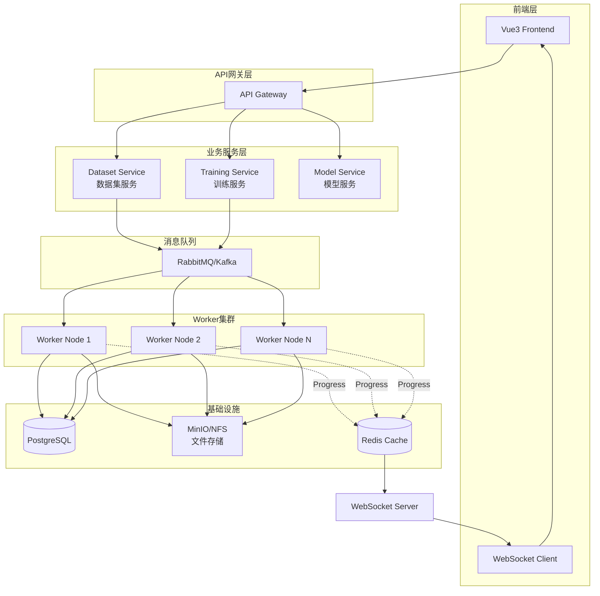

# 数据集构建与模型训练Pipeline设计方案

## 一、系统概述

### 1.1 背景

基于现有的图像管理和标注管理功能，需要构建一个自动化的训练数据生成和模型训练Pipeline系统。该系统需要：
- 支持从已有标注数据自动生成多种格式的训练数据集（YOLO、COCO、VOC等）
- 异步执行耗时操作，避免阻塞用户请求
- 支持任务进度实时监控
- 可扩展集成其他算法（如Segment Anything、Classification等）

### 1.2 核心目标

1. **自动化**：一键生成符合标准的训练数据集（支持多种格式）
2. **通用化**：通过algorithm_type字段支持任意算法类型
3. **异步化**：长时间任务后台执行，不阻塞前端
4. **可视化**：实时展示任务进度和状态
5. **可扩展**：统一的抽象接口，便于集成新算法
6. **微服务友好**：支持分布式部署和横向扩展

---

## 二、系统架构设计

### 2.1 整体架构图



### 2.2 技术栈选型

| 层级 | 技术选型 | 说明 |
|------|---------|------|
| 前端 | Vue3 + TypeScript + Element Plus | 现代化UI框架 |
| API网关 | Spring Cloud Gateway | 路由、鉴权、限流 |
| 业务服务 | Spring Boot 3.x | 微服务框架 |
| 消息队列 | RabbitMQ / Kafka | 任务调度、解耦 |
| 数据库 | PostgreSQL 14+ | 关系型数据存储 |
| 缓存 | Redis | 任务进度缓存、会话 |
| 文件存储 | MinIO / NFS | 数据集、模型文件存储 |
| WebSocket | Spring WebSocket | 实时进度推送 |
| 监控 | Prometheus + Grafana | 性能监控 |

---

## 三、数据库设计

### 3.1 设计理念

**采用专用表而非通用表的设计原则：**

1. **职责明确**：每个算法任务有专用的表结构，字段语义清晰
2. **类型安全**：避免过度使用 JSONB 导致维护困难
3. **性能优化**：针对特定业务场景设计索引和查询
4. **易于扩展**：新增算法时创建专用表，不影响现有表
5. **关联完整**：通过外键 ID 建立表间关联（应用层维护）

**保留的表：**
- `biz_dataset_build_task` - 通用数据集构建任务（支持多种算法）
- `biz_yolo_training_task` - YOLO模型训练任务
- `biz_model` - 模型注册表（通用，支持多种算法）
- `biz_prediction` - 预测结果表（通用，支持多种算法）

**删除的表：**
- ~~`biz_algorithm_task`~~ - 通用算法任务表（过于灵活，定位模糊）

### 3.2 核心表结构

#### 3.2.1 通用数据集构建任务表

```sql
-- ============================================================================
-- 通用数据集构建任务表 (biz_dataset_build_task)
-- 支持YOLO、COCO、VOC等多种算法格式
-- ============================================================================
CREATE TABLE biz_dataset_build_task (
    task_id BIGSERIAL PRIMARY KEY,
    task_no VARCHAR(50) NOT NULL UNIQUE,
    project_id BIGINT NOT NULL,
    batch_ids JSONB,                    -- 批次ID列表（JSON数组）
    label_ids JSONB,                    -- 标签ID列表（JSON数组）
    algorithm_type VARCHAR(50) NOT NULL DEFAULT 'YOLO', -- 算法类型（YOLO/COCO/VOC/SAM等）
    task_name VARCHAR(200) NOT NULL,
    description TEXT,
    
    -- ========== 数据集配置 ==========
    train_ratio FLOAT DEFAULT 0.7,      -- 训练集比例
    val_ratio FLOAT DEFAULT 0.2,        -- 验证集比例
    test_ratio FLOAT DEFAULT 0.1,       -- 测试集比例
    class_mapping JSONB,                -- 类别映射配置 {old_name: new_name}
    shuffle BOOLEAN DEFAULT TRUE,       -- 是否打乱数据
    
    -- ========== 输出配置 ==========
    output_format VARCHAR(20) DEFAULT 'yolov8', -- 输出格式（根据算法类型不同）
    include_images BOOLEAN DEFAULT TRUE,         -- 是否包含图像文件
    compress_format VARCHAR(10) DEFAULT 'none',  -- 压缩格式 (zip/tar.gz/none)
    compress_quality INT,                        -- 压缩质量（可选）
    min_image_size INT,                          -- 最小图像尺寸（过滤条件）
    max_image_size INT,                          -- 最大图像尺寸（过滤条件）
    extra_config JSONB,                 -- 额外配置（算法特有参数）
    
    -- ========== 任务状态 ==========
    status VARCHAR(20) DEFAULT 'PENDING',        -- PENDING/RUNNING/SUCCESS/FAILED/CANCELLED
    progress FLOAT DEFAULT 0,                    -- 进度 0-100
    current_step VARCHAR(100),                   -- 当前执行步骤描述
    step_detail JSONB,                           -- 步骤详细信息
    
    -- ========== 结果信息 ==========
    total_images INT DEFAULT 0,                  -- 总图像数
    total_annotations INT DEFAULT 0,             -- 总标注数
    train_count INT DEFAULT 0,                   -- 训练集数量
    val_count INT DEFAULT 0,                     -- 验证集数量
    test_count INT DEFAULT 0,                    -- 测试集数量
    class_distribution JSONB,                    -- 类别分布统计 {class_name: count}
    dataset_path VARCHAR(500),                   -- 数据集文件路径
    dataset_size BIGINT,                         -- 数据集文件大小（字节）
    data_yaml_path VARCHAR(500),                 -- 配置文件路径（如data.yaml）
    
    -- ========== 训练关联 ==========
    auto_trigger_training BOOLEAN DEFAULT FALSE, -- 是否自动触发训练
    training_config JSONB,                       -- 训练配置模板
    training_task_id BIGINT,                     -- 关联的训练任务ID
    
    -- ========== 错误信息 ==========
    error_message TEXT,
    error_stack TEXT,
    failed_images JSONB,                         -- 失败的图像列表 [{imageId, filename, reason}]
    
    -- ========== 审计字段 ==========
    create_by BIGINT,
    create_time TIMESTAMP NOT NULL DEFAULT NOW(),
    start_time TIMESTAMP,
    end_time TIMESTAMP,
    duration_seconds INT,
    update_by BIGINT,
    update_time TIMESTAMP NOT NULL DEFAULT NOW()
);

COMMENT ON TABLE biz_dataset_build_task IS '通用数据集构建任务表（支持多种算法格式）';
COMMENT ON COLUMN biz_dataset_build_task.task_id IS '主键ID';
COMMENT ON COLUMN biz_dataset_build_task.task_no IS '任务编号（唯一）';
COMMENT ON COLUMN biz_dataset_build_task.project_id IS '所属项目ID';
COMMENT ON COLUMN biz_dataset_build_task.batch_ids IS '批次ID列表（JSON数组）';
COMMENT ON COLUMN biz_dataset_build_task.label_ids IS '标签ID列表（JSON数组）';
COMMENT ON COLUMN biz_dataset_build_task.algorithm_type IS '算法类型（YOLO/COCO/VOC/SAM等）';
COMMENT ON COLUMN biz_dataset_build_task.train_ratio IS '训练集比例';
COMMENT ON COLUMN biz_dataset_build_task.val_ratio IS '验证集比例';
COMMENT ON COLUMN biz_dataset_build_task.test_ratio IS '测试集比例';
COMMENT ON COLUMN biz_dataset_build_task.class_mapping IS '类别映射配置（JSON对象）';
COMMENT ON COLUMN biz_dataset_build_task.output_format IS '输出格式（根据算法类型不同）';
COMMENT ON COLUMN biz_dataset_build_task.compress_quality IS '压缩质量（可选）';
COMMENT ON COLUMN biz_dataset_build_task.min_image_size IS '最小图像尺寸（过滤条件）';
COMMENT ON COLUMN biz_dataset_build_task.max_image_size IS '最大图像尺寸（过滤条件）';
COMMENT ON COLUMN biz_dataset_build_task.extra_config IS '额外配置（算法特有参数，JSON）';
COMMENT ON COLUMN biz_dataset_build_task.status IS '任务状态';
COMMENT ON COLUMN biz_dataset_build_task.progress IS '任务进度（0-100）';
COMMENT ON COLUMN biz_dataset_build_task.current_step IS '当前执行步骤';
COMMENT ON COLUMN biz_dataset_build_task.step_detail IS '步骤详细信息（JSON）';
COMMENT ON COLUMN biz_dataset_build_task.dataset_path IS '生成的数据集文件路径';
COMMENT ON COLUMN biz_dataset_build_task.auto_trigger_training IS '是否自动触发训练';
COMMENT ON COLUMN biz_dataset_build_task.training_task_id IS '关联的训练任务ID';

-- 索引优化
CREATE INDEX idx_dataset_build_project ON biz_dataset_build_task(project_id);
CREATE INDEX idx_dataset_build_status ON biz_dataset_build_task(status);
CREATE INDEX idx_dataset_build_create_time ON biz_dataset_build_task(create_time DESC);
CREATE INDEX idx_dataset_build_algorithm ON biz_dataset_build_task(algorithm_type);
CREATE INDEX idx_dataset_build_task_no ON biz_dataset_build_task(task_no);
```

#### 3.2.2 YOLO模型训练任务表

```sql
-- ============================================================================
-- YOLO模型训练任务表 (biz_yolo_training_task)
-- ============================================================================
CREATE TABLE biz_yolo_training_task (
    task_id BIGSERIAL PRIMARY KEY,
    task_no VARCHAR(50) NOT NULL UNIQUE,
    project_id BIGINT NOT NULL,
    task_name VARCHAR(200) NOT NULL,
    description TEXT,
    
    -- ========== 数据源 ==========
    dataset_task_id BIGINT,                      -- 关联的数据集构建任务ID
    dataset_path VARCHAR(500),                   -- 数据集路径
    custom_dataset_path VARCHAR(500),            -- 自定义数据集路径
    dataset_config JSONB,                        -- 数据集配置快照
    
    -- ========== 训练配置 ==========
    model_architecture VARCHAR(50) DEFAULT 'yolov8n', -- 模型架构 (yolov8n/s/m/l/x)
    pretrained_weights VARCHAR(100),             -- 预训练权重 (coco/imagenet/custom)
    epochs INT DEFAULT 100,                      -- 训练轮数
    batch_size INT DEFAULT 16,                   -- 批次大小
    image_size INT DEFAULT 640,                  -- 图像尺寸
    learning_rate FLOAT DEFAULT 0.01,            -- 学习率
    momentum FLOAT DEFAULT 0.937,                -- 动量
    weight_decay FLOAT DEFAULT 0.0005,           -- 权重衰减
    optimizer VARCHAR(20) DEFAULT 'SGD',         -- 优化器 (SGD/Adam/AdamW)
    lr_scheduler VARCHAR(20) DEFAULT 'cosine',   -- 学习率调度器
    warmup_epochs INT DEFAULT 3,                 -- 预热轮数
    patience INT DEFAULT 50,                     -- 早停耐心值
    additional_params JSONB,                     -- 额外参数
    
    -- ========== 增强配置 ==========
    augmentation_config JSONB,                   -- 数据增强配置
    hsv_h FLOAT DEFAULT 0.015,                   -- HSV色调增强
    hsv_s FLOAT DEFAULT 0.7,                     -- HSV饱和度增强
    hsv_v FLOAT DEFAULT 0.4,                     -- HSV亮度增强
    degrees FLOAT DEFAULT 0.0,                   -- 旋转角度
    translate FLOAT DEFAULT 0.1,                 -- 平移
    scale FLOAT DEFAULT 0.5,                     -- 缩放
    shear FLOAT DEFAULT 0.0,                     -- 剪切
    perspective FLOAT DEFAULT 0.0,               -- 透视
    flip_lr BOOLEAN DEFAULT TRUE,                -- 水平翻转
    flip_ud BOOLEAN DEFAULT FALSE,               -- 垂直翻转
    
    -- ========== 硬件配置 ==========
    gpu_ids VARCHAR(50),                         -- GPU设备ID (0,1,2或cpu)
    num_workers INT DEFAULT 4,                   -- 数据加载线程数
    mixed_precision BOOLEAN DEFAULT TRUE,        -- 混合精度训练
    
    -- ========== 任务状态 ==========
    status VARCHAR(20) DEFAULT 'PENDING',        -- PENDING/RUNNING/SUCCESS/FAILED/CANCELLED
    progress FLOAT DEFAULT 0,                    -- 进度 0-100
    current_epoch INT DEFAULT 0,                 -- 当前训练轮数
    current_step VARCHAR(100),                   -- 当前步骤描述
    
    -- ========== 训练指标 ==========
    metrics_json JSONB,                          -- 训练指标（实时）{epoch, loss, map, precision, recall}
    best_metrics JSONB,                          -- 最佳指标
    training_logs_path VARCHAR(500),             -- 训练日志路径
    tensorboard_log_path VARCHAR(500),           -- TensorBoard日志路径
    
    -- ========== 模型输出 ==========
    model_id BIGINT,                             -- 关联的模型注册ID（biz_model）
    model_path VARCHAR(500),                     -- 最终模型路径
    best_model_path VARCHAR(500),                -- 最佳模型路径
    last_model_path VARCHAR(500),                -- 最后一轮模型路径
    model_size BIGINT,                           -- 模型文件大小
    inference_time_ms FLOAT,                     -- 推理时间（毫秒）
    
    -- ========== 评估结果 ==========
    evaluation_results JSONB,                    -- 评估结果 {map50, map50_95, precision, recall}
    confusion_matrix_path VARCHAR(500),          -- 混淆矩阵图片路径
    pr_curve_path VARCHAR(500),                  -- PR曲线图片路径
    
    -- ========== 错误信息 ==========
    error_message TEXT,
    error_stack TEXT,
    
    -- ========== 审计字段 ==========
    create_by BIGINT,
    create_time TIMESTAMP NOT NULL DEFAULT NOW(),
    start_time TIMESTAMP,
    end_time TIMESTAMP,
    duration_seconds INT,
    update_by BIGINT,
    update_time TIMESTAMP NOT NULL DEFAULT NOW()
);

COMMENT ON TABLE biz_yolo_training_task IS 'YOLO模型训练任务表';
COMMENT ON COLUMN biz_yolo_training_task.dataset_task_id IS '关联的数据集构建任务ID';
COMMENT ON COLUMN biz_yolo_training_task.model_architecture IS '模型架构（yolov8n/yolov8s/yolov8m等）';
COMMENT ON COLUMN biz_yolo_training_task.pretrained_weights IS '预训练权重路径';
COMMENT ON COLUMN biz_yolo_training_task.epochs IS '训练轮数';
COMMENT ON COLUMN biz_yolo_training_task.metrics_json IS '训练指标（JSON格式）';
COMMENT ON COLUMN biz_yolo_training_task.best_metrics IS '最佳性能指标';
COMMENT ON COLUMN biz_yolo_training_task.model_id IS '关联的模型注册ID（biz_model表）';
COMMENT ON COLUMN biz_yolo_training_task.model_path IS '最终模型路径';
COMMENT ON COLUMN biz_yolo_training_task.best_model_path IS '最佳模型路径';
COMMENT ON COLUMN biz_yolo_training_task.evaluation_results IS '评估结果';

-- 索引优化
CREATE INDEX idx_training_task_project ON biz_yolo_training_task(project_id);
CREATE INDEX idx_training_task_status ON biz_yolo_training_task(status);
CREATE INDEX idx_training_task_dataset ON biz_yolo_training_task(dataset_task_id);
CREATE INDEX idx_training_task_create_time ON biz_yolo_training_task(create_time DESC);
CREATE INDEX idx_training_task_model ON biz_yolo_training_task(model_architecture);
CREATE INDEX idx_training_task_model_id ON biz_yolo_training_task(model_id);
```

---

## 四、核心抽象接口设计

### 4.1 设计理念

为了支持多种算法的集成，我们设计了**四层抽象架构**：

1. **AlgorithmConfig** - 算法配置接口（所有配置类必须实现）
2. **ConfigParser** - 配置解析器接口（负责JSON反序列化 + 自动验证）
3. **ConfigManager** - 配置管理器（通过算法类型自动路由到对应的解析器）
4. **AlgorithmTaskExecutor** - 算法任务执行器接口（顶层抽象）
   - **DatasetBuilder** - 数据集构建器接口
   - **ModelTrainer** - 模型训练器接口

**核心优势：**
- ✅ **类型安全**：泛型保证编译期类型检查，避免运行时ClassCastException
- ✅ **自动验证**：解析配置后自动调用validate()方法
- ✅ **易于扩展**：新增算法只需添加ConfigParser，无需修改现有代码
- ✅ **符合SOLID原则**：单一职责、开闭原则、依赖倒置
- ✅ **Spring友好**：自动发现和注入ConfigParser

### 4.2 核心接口定义

#### 4.2.1 算法配置接口（AlgorithmConfig）

```java
package com.jnet.biz.algorithm.config;

/**
 * 算法配置接口
 * 所有算法配置类必须实现此接口，以确保类型安全和统一验证
 */
public interface AlgorithmConfig {
    
    /**
     * 获取算法类型
     * @return 算法类型标识（如：YOLO, COCO, VOC, SAM, CLASSIFICATION）
     */
    String getAlgorithmType();
    
    /**
     * 验证配置参数
     * 在解析配置后自动调用，确保配置的有效性
     * 
     * @throws IllegalArgumentException 配置无效时抛出异常
     */
    void validate();
    
    /**
     * 获取默认配置
     * 可用于配置合并或初始化
     */
    default AlgorithmConfig getDefaultConfig() {
        return this;
    }
}
```

**设计优势：**
- 统一的配置验证入口
- 编译期类型检查
- 支持配置合并和默认值

#### 4.2.2 配置解析器接口（ConfigParser）

```java
package com.jnet.biz.algorithm.config;

import com.alibaba.fastjson2.JSON;

/**
 * 配置解析器接口
 * 负责将JSON字符串解析为具体的配置对象，并自动验证
 * 
 * @param <C> 配置类型，必须实现AlgorithmConfig接口
 */
public interface ConfigParser<C extends AlgorithmConfig> {
    
    /**
     * 支持的算法类型
     */
    String getSupportedAlgorithmType();
    
    /**
     * 解析配置
     * 从JSON字符串解析为配置对象，并自动调用validate()验证
     */
    C parse(String configJson);
    
    /**
     * 默认实现：使用FastJSON解析并自动验证
     * 子类可以直接复用此方法，无需重复实现
     */
    default C parseAndValidate(String configJson, Class<C> configClass) {
        C config = JSON.parseObject(configJson, configClass);
        config.validate(); // 自动验证
        return config;
    }
}
```

**使用示例：**

```java
@Component
public class YoloDatasetConfigParser implements ConfigParser<YoloDatasetConfig> {
    
    @Override
    public String getSupportedAlgorithmType() {
        return "YOLO";
    }
    
    @Override
    public YoloDatasetConfig parse(String configJson) {
        // 复用父类的默认实现：反序列化 + 自动验证
        return parseAndValidate(configJson, YoloDatasetConfig.class);
    }
}
```

#### 4.2.3 配置管理器（ConfigManager）

```java
package com.jnet.biz.algorithm.config;

@Component
public class ConfigManager {
    
    private final List<ConfigParser<?>> configParsers;
    private final Map<String, ConfigParser<?>> parserMap;
    
    @PostConstruct
    public void init() {
        // Spring容器启动时自动注册所有解析器
        for (ConfigParser<?> parser : configParsers) {
            parserMap.put(parser.getSupportedAlgorithmType(), parser);
        }
    }
    
    /**
     * 解析配置（泛型方法，类型安全）
     */
    public <C extends AlgorithmConfig> C parseConfig(
            String configJson, 
            String algorithmType,
            Class<C> configClass) {
        
        ConfigParser<?> parser = parserMap.get(algorithmType.toUpperCase());
        if (parser == null) {
            throw new IllegalArgumentException(
                "不支持的算法类型: " + algorithmType);
        }
        
        return (C) parser.parse(configJson);
    }
}
```

**Consumer层使用示例：**

```java
@Component
@RequiredArgsConstructor
public class DatasetBuildConsumer {
    
    private final ConfigManager configManager;
    private final Map<String, DatasetBuilder<?>> datasetBuilders;
    
    @RabbitListener(queues = RabbitMQConfig.DATASET_BUILD_QUEUE)
    public void handleDatasetBuildTask(String messageJson) {
        AlgorithmTaskMessage message = JSON.parseObject(messageJson, AlgorithmTaskMessage.class);
        
        // ✅ 类型安全的配置解析（无需switch语句）
        YoloDatasetConfig config = configManager.parseConfig(
            message.getConfigJson(),
            message.getAlgorithmType(),
            YoloDatasetConfig.class
        );
        
        // ✅ 类型安全的构建器查找（泛型方法）
        DatasetBuilder<YoloDatasetConfig> builder = findDatasetBuilder(
            message.getAlgorithmType(), 
            YoloDatasetConfig.class
        );
        
        // ✅ 直接调用，无需强制转换
        DatasetBuildResult result = builder.execute(config, context);
        
        log.info("开始构建YOLO数据集: projectId={}, outputFormat={}", 
                 config.getProjectId(), config.getOutputFormat());
    }
    
    /**
     * 查找数据集构建器（泛型方法，类型安全）
     */
    @SuppressWarnings("unchecked")
    private <C> DatasetBuilder<C> findDatasetBuilder(
            String algorithmType, 
            Class<C> configClass) {
        for (DatasetBuilder<?> builder : datasetBuilders.values()) {
            if (builder.getAlgorithmType().equalsIgnoreCase(algorithmType)) {
                return (DatasetBuilder<C>) builder;
            }
        }
        return null;
    }
}
```

**关键改进：**
- ✅ 消除 `@SuppressWarnings({"unchecked", "rawtypes"})`
- ✅ 消除原始类型 `(DatasetBuilder) builder`
- ✅ 消除强制转换 `(DatasetBuildResult)`
- ✅ 编译期类型检查，避免运行时ClassCastException

#### 4.2.1 算法任务执行器接口

```java
package com.jnet.biz.algorithm;

import java.util.concurrent.CompletableFuture;

/**
 * 算法任务执行器接口
 * 所有算法任务（数据集构建、训练、预测、评估）都需要实现此接口
 * 
 * @param <C> 配置类型
 * @param <R> 结果类型
 */
public interface AlgorithmTaskExecutor<C, R> {
    
    /**
     * 获取算法类型
     * @return 算法类型标识（如：YOLO, SAM, CLASSIFICATION）
     */
    String getAlgorithmType();
    
    /**
     * 获取任务类型
     * @return 任务类型（DATASET_BUILD, TRAINING, PREDICTION, EVALUATION）
     */
    String getTaskType();
    
    /**
     * 验证配置参数
     * @param config 配置对象
     * @throws IllegalArgumentException 配置无效时抛出
     */
    void validateConfig(C config);
    
    /**
     * 执行任务（同步）
     * @param config 配置对象
     * @param context 执行上下文（包含任务ID、进度回调等）
     * @return 执行结果
     * @throws Exception 执行失败时抛出
     */
    R execute(C config, TaskExecutionContext context) throws Exception;
    
    /**
     * 执行任务（异步）
     * @param config 配置对象
     * @param context 执行上下文
     * @return 未来结果
     */
    default CompletableFuture<R> executeAsync(C config, TaskExecutionContext context) {
        return CompletableFuture.supplyAsync(() -> {
            try {
                return execute(config, context);
            } catch (Exception e) {
                throw new RuntimeException(e);
            }
        });
    }
}
```

**设计要点：**
- ✅ **职责单一**：只负责任务执行，不包含查询、取消、清理等功能
- ✅ **泛型支持**：编译期类型安全，避免运行时ClassCastException
- ✅ **异步支持**：提供默认的executeAsync实现，简化异步任务开发
- ✅ **符合SOLID原则**：接口隔离、单一职责、依赖倒置

#### 4.2.2 任务执行上下文

```java
package com.jnet.biz.algorithm;

import java.util.function.Consumer;

/**
 * 任务执行上下文
 * 提供进度更新、日志记录、取消检查等功能
 */
public interface TaskExecutionContext {
    
    /**
     * 获取任务ID
     */
    String getTaskId();
    
    /**
     * 获取任务编号
     */
    String getTaskNo();
    
    /**
     * 获取项目ID
     */
    Long getProjectId();
    
    /**
     * 获取创建人ID
     */
    Long getCreateBy();
    
    /**
     * 获取任务类型
     * @return 任务类型（DATASET_BUILD/TRAINING/PREDICTION）
     */
    String getTaskType();
    
    /**
     * 更新任务进度
     * @param progress 进度（0-100）
     * @param step 当前步骤描述
     */
    void updateProgress(float progress, String step);
    
    /**
     * 更新任务进度（带详细信息）
     * @param progress 进度（0-100）
     * @param step 当前步骤描述
     * @param detail 步骤详细信息（JSON）
     */
    void updateProgress(float progress, String step, Object detail);
    
    /**
     * 记录日志
     * @param level 日志级别
     * @param message 日志消息
     */
    void log(LogLevel level, String message);
    
    /**
     * 检查任务是否被取消
     * @return true-已取消，false-未取消
     */
    boolean isCancelled();
    
    /**
     * 注册取消回调
     * @param callback 取消时的回调函数
     */
    void onCancel(Runnable callback);
    
    /**
     * 获取附加属性
     * @param key 属性键
     * @return 属性值
     */
    Object getAttribute(String key);
    
    /**
     * 设置附加属性
     * @param key 属性键
     * @param value 属性值
     */
    void setAttribute(String key, Object value);
    
    /**
     * 日志级别枚举
     */
    enum LogLevel {
        DEBUG, INFO, WARN, ERROR
    }
}
```

#### 4.2.3 任务上下文管理器

```java
package com.jnet.biz.algorithm;

import com.jnet.biz.dto.AlgorithmTaskMessage;

/**
 * 任务上下文管理器接口
 * 负责任务上下文的创建、更新和销毁
 */
public interface TaskContextManager {
    
    /**
     * 创建任务执行上下文
     * 
     * @param message 任务消息
     * @return 任务执行上下文
     */
    TaskExecutionContext createContext(AlgorithmTaskMessage message);
    
    /**
     * 更新任务进度
     * 
     * @param taskId 任务ID
     * @param progress 进度（0-100）
     * @param currentStep 当前步骤
     * @param stepDetail 步骤详情（JSON）
     */
    void updateTaskProgress(String taskId, Float progress, String currentStep, String stepDetail);
    
    /**
     * 移除任务上下文
     * 
     * @param taskId 任务ID
     */
    void removeContext(String taskId);
    
    /**
     * 取消任务（触发上下文中的取消标志）
     * 支持分布式环境，使用Redis存储取消状态
     * 
     * @param taskId 任务ID
     * @return true-成功触发取消，false-任务不存在
     */
    boolean cancelTask(String taskId);
}
```

**核心功能：**
- ✅ **上下文生命周期管理**：创建、更新、销毁
- ✅ **分布式取消支持**：通过Redis实现跨节点取消
- ✅ **进度同步**：数据库持久化 + WebSocket实时推送
- ✅ **TTL机制**：取消标志24小时自动过期
### 4.3 算法任务消息DTO

```java
package com.jnet.biz.dto;

import lombok.Data;

import java.io.Serial;
import java.io.Serializable;

/**
 * 算法任务消息DTO
 * 用于RabbitMQ消息传递，承载任务执行所需的所有信息
 */
@Data
public class AlgorithmTaskMessage implements Serializable {
    
    @Serial
    private static final long serialVersionUID = 1L;
    
    /**
     * 消息ID（用于幂等性检查）
     */
    private String messageId;
    
    /**
     * 任务ID
     */
    private Long taskId;
    
    /**
     * 任务编号
     */
    private String taskNo;
    
    /**
     * 算法类型 (YOLO/SAM/CLASSIFICATION)
     */
    private String algorithmType;
    
    /**
     * 任务类型 (DATASET_BUILD/TRAINING/PREDICTION)
     */
    private String taskType;
    
    /**
     * 项目ID
     */
    private Long projectId;
    
    /**
     * 创建人ID
     */
    private Long createBy;
    
    /**
     * 配置参数（JSON字符串）
     */
    private String configJson;
    
    /**
     * 重试次数
     */
    private Integer retryCount = 0;
    
    /**
     * 创建时间戳
     */
    private Long timestamp;
}
```

**设计要点：**
- ✅ **幂等性支持**：messageId用于去重
- ✅ **灵活配置**：configJson存储算法特定配置
- ✅ **重试机制**：retryCount记录重试次数
- ✅ **完整上下文**：包含任务执行所需的所有元数据
- ✅ **序列化支持**：实现Serializable接口，支持RabbitMQ传输

---

### 4.4 数据集构建器接口

```java
package com.jnet.biz.algorithm.dataset;

import com.jnet.biz.algorithm.AlgorithmTaskExecutor;
import com.jnet.biz.algorithm.TaskExecutionContext;
import java.util.List;
import java.util.Map;

/**
 * 数据集构建器接口
 * 用于将标注数据转换为特定格式的训练数据集
 * 
 * @param <C> 配置类型
 */
public interface DatasetBuilder<C> extends AlgorithmTaskExecutor<C, DatasetBuildResult> {
    
    @Override
    default String getTaskType() {
        return "DATASET_BUILD";
    }
    
    /**
     * 查询符合条件的图像和标注数据
     * @param config 配置对象
     * @return 图像标注数据列表
     */
    List<ImageAnnotationData> queryImageData(C config);
    
    /**
     * 划分训练/验证/测试集
     * @param dataList 全部数据
     * @param config 配置对象
     * @return 划分结果
     */
    DatasetSplit splitDataset(List<ImageAnnotationData> dataList, C config);
    
    /**
     * 转换标注格式
     * @param data 图像标注数据
     * @param config 配置对象
     * @return 转换后的标注内容
     */
    String convertAnnotationFormat(ImageAnnotationData data, C config);
    
    /**
     * 生成配置文件
     * @param config 配置对象
     * @param classDistribution 类别分布
     * @param outputDir 输出目录
     * @return 配置文件路径
     */
    String generateConfigFile(C config, Map<String, Integer> classDistribution, String outputDir);
}

/**
 * 数据集构建结果
 */
@Data
public class DatasetBuildResult {
    private String datasetPath;        // 数据集路径
    private Long datasetSize;          // 数据集大小（字节）
    private Integer totalImages;       // 总图像数
    private Integer totalAnnotations;  // 总标注数
    private Integer trainCount;        // 训练集数量
    private Integer valCount;          // 验证集数量
    private Integer testCount;         // 测试集数量
    private Map<String, Integer> classDistribution; // 类别分布
    private String configFilePath;     // 配置文件路径
    private String format;             // 数据格式
}

/**
 * 图像标注数据
 */
@Data
public class ImageAnnotationData {
    private Long imageId;
    private String filename;
    private String filePath;
    private Integer width;
    private Integer height;
    private List<AnnotationData> annotations;
}

/**
 * 标注数据
 */
@Data
public class AnnotationData {
    private Long annotationId;
    private String type;              // polygon/rectangle/point
    private String className;         // 类别名称
    private Integer classId;          // 类别ID
    private Object coordinates;       // 坐标数据（根据类型不同而不同）
    private Map<String, Object> attributes; // 附加属性
}

/**
 * 数据集划分结果
 */
@Data
public class DatasetSplit {
    private List<ImageAnnotationData> trainSet;
    private List<ImageAnnotationData> valSet;
    private List<ImageAnnotationData> testSet;
}
```

### 4.5 模型训练器接口

```java
package com.jnet.biz.algorithm.training;

import com.jnet.biz.algorithm.AlgorithmTaskExecutor;
import com.jnet.biz.algorithm.TaskExecutionContext;
import java.util.Map;

/**
 * 模型训练器接口
 * 用于训练机器学习模型
 * 
 * @param <C> 配置类型
 */
public interface ModelTrainer<C> extends AlgorithmTaskExecutor<C, TrainingResult> {
    
    @Override
    default String getTaskType() {
        return "TRAINING";
    }
    
    /**
     * 准备训练环境
     * @param config 配置对象
     * @return 准备工作目录路径
     */
    String prepareTrainingEnvironment(C config);
    
    /**
     * 执行训练
     * @param config 配置对象
     * @param workDir 工作目录
     * @param context 执行上下文
     * @return 训练结果
     */
    TrainingResult doTraining(C config, String workDir, TaskExecutionContext context);
    
    /**
     * 评估模型
     * @param modelPath 模型路径
     * @param testDatasetPath 测试数据集路径
     * @return 评估结果
     */
    EvaluationResult evaluateModel(String modelPath, String testDatasetPath);
    
    /**
     * 导出模型
     * @param modelPath 原始模型路径
     * @param exportFormat 导出格式（onnx/tensorrt/openvino）
     * @return 导出后的模型路径
     */
    String exportModel(String modelPath, String exportFormat);
}

/**
 * 训练结果
 */
@Data
public class TrainingResult {
    private String modelPath;           // 最终模型路径
    private String bestModelPath;       // 最佳模型路径
    private Long modelSize;             // 模型大小
    private Map<String, Object> metrics; // 训练指标
    private Map<String, Object> bestMetrics; // 最佳指标
    private Integer totalEpochs;        // 总训练轮数
    private Long trainingTimeSeconds;   // 训练耗时（秒）
    private String logsPath;            // 日志路径
    private String tensorboardPath;     // TensorBoard日志路径
}

/**
 * 评估结果
 */
@Data
public class EvaluationResult {
    private Float map50;                // mAP@0.5
    private Float map50_95;             // mAP@0.5:0.95
    private Float precision;            // 精确率
    private Float recall;               // 召回率
    private Float f1Score;              // F1分数
    private Object confusionMatrix;     // 混淆矩阵
    private String prCurvePath;         // PR曲线图路径
    private Map<String, Float> perClassMetrics; // 各类别指标
}
```

---

## 五、YOLO具体实现

### 5.1 通用数据集构建器实现示例（以YOLO为例）

```java
package com.jnet.biz.algorithm.yolo;

import com.jnet.biz.algorithm.dataset.DatasetBuilder;
import com.jnet.biz.algorithm.dataset.DatasetBuildResult;
import com.jnet.biz.algorithm.dataset.DatasetSplit;
import com.jnet.biz.algorithm.dataset.ImageAnnotationData;
import com.jnet.biz.algorithm.TaskExecutionContext;
import lombok.extern.slf4j.Slf4j;
import org.springframework.stereotype.Component;

import java.io.*;
import java.nio.file.*;
import java.util.*;
import java.util.stream.Collectors;

/**
 * 通用数据集构建器实现示例
 * 通过algorithm_type区分不同的算法实现
 */
@Component
@Slf4j
public class YoloDatasetBuilder implements DatasetBuilder<YoloDatasetConfig> {
    
    @Override
    public String getAlgorithmType() {
        return "YOLO";
    }
    
    @Override
    public void validateConfig(YoloDatasetConfig config) {
        if (config.getProjectId() == null) {
            throw new IllegalArgumentException("项目ID不能为空");
        }
        
        float totalRatio = config.getTrainRatio() + config.getValRatio() + config.getTestRatio();
        if (Math.abs(totalRatio - 1.0f) > 0.01f) {
            throw new IllegalArgumentException("训练/验证/测试集比例之和必须等于1");
        }
        
        if (config.getOutputFormat() == null || 
            (!config.getOutputFormat().equals("yolov5") && !config.getOutputFormat().equals("yolov8"))) {
            throw new IllegalArgumentException("输出格式必须是yolov5或yolov8");
        }
    }
    
    @Override
    public DatasetBuildResult execute(YoloDatasetConfig config, TaskExecutionContext context) throws Exception {
        String taskId = context.getTaskId();
        log.info("开始构建YOLO数据集: taskId={}", taskId);
        
        try {
            // Step 1: 验证配置
            context.updateProgress(5f, "验证配置参数");
            validateConfig(config);
            
            // Step 2: 查询数据
            context.updateProgress(10f, "查询图像和标注数据");
            List<ImageAnnotationData> dataList = queryImageData(config);
            
            if (dataList.isEmpty()) {
                throw new RuntimeException("未找到符合条件的图像和标注数据");
            }
            
            context.log(TaskExecutionContext.LogLevel.INFO, 
                String.format("查询到 %d 张图像", dataList.size()));
            
            // Step 3: 统计类别分布
            context.updateProgress(20f, "统计类别分布");
            Map<String, Integer> classDistribution = calculateClassDistribution(dataList);
            context.log(TaskExecutionContext.LogLevel.INFO, 
                String.format("类别分布: %s", classDistribution));
            
            // Step 4: 应用类别映射
            if (config.getClassMapping() != null && !config.getClassMapping().isEmpty()) {
                applyClassMapping(dataList, config.getClassMapping());
                classDistribution = recalculateClassDistribution(dataList);
            }
            
            // Step 5: 划分数据集
            context.updateProgress(30f, "划分训练/验证/测试集");
            DatasetSplit split = splitDataset(dataList, config);
            
            context.log(TaskExecutionContext.LogLevel.INFO, 
                String.format("数据集划分: 训练集=%d, 验证集=%d, 测试集=%d",
                    split.getTrainSet().size(), 
                    split.getValSet().size(),
                    split.getTestSet().size()));
            
            // Step 6: 创建目录结构
            context.updateProgress(40f, "创建目录结构");
            String datasetDir = createDatasetDirectory(config, taskId);
            
            // Step 7: 生成YOLO格式标注文件
            context.updateProgress(50f, "生成YOLO格式标注文件");
            generateYoloLabels(split.getTrainSet(), datasetDir + "/train/labels", context);
            generateYoloLabels(split.getValSet(), datasetDir + "/val/labels", context);
            if (!split.getTestSet().isEmpty()) {
                generateYoloLabels(split.getTestSet(), datasetDir + "/test/labels", context);
            }
            
            // Step 8: 复制图像文件
            if (Boolean.TRUE.equals(config.getIncludeImages())) {
                context.updateProgress(70f, "复制图像文件");
                copyImagesToDataset(split, datasetDir, context);
            }
            
            // Step 9: 生成data.yaml配置文件
            context.updateProgress(85f, "生成配置文件");
            String dataYamlPath = generateDataYaml(config, classDistribution, datasetDir);
            
            // Step 10: 打包压缩
            context.updateProgress(95f, "打包压缩");
            String zipPath = compressDataset(datasetDir, config.getCompressFormat());
            
            // 完成
            context.updateProgress(100f, "完成");
            
            // 构建结果
            DatasetBuildResult result = new DatasetBuildResult();
            result.setDatasetPath(zipPath);
            result.setDatasetSize(Files.size(Paths.get(zipPath)));
            result.setTotalImages(dataList.size());
            result.setTotalAnnotations(classDistribution.values().stream().mapToInt(Integer::intValue).sum());
            result.setTrainCount(split.getTrainSet().size());
            result.setValCount(split.getValSet().size());
            result.setTestCount(split.getTestSet().size());
            result.setClassDistribution(classDistribution);
            result.setConfigFilePath(dataYamlPath);
            result.setFormat(config.getOutputFormat());
            
            log.info("YOLO数据集构建完成: taskId={}, path={}, size={}", 
                    taskId, zipPath, result.getDatasetSize());
            
            return result;
            
        } catch (Exception e) {
            log.error("YOLO数据集构建失败: taskId={}", taskId, e);
            throw e;
        }
    }
    
    @Override
    public List<ImageAnnotationData> queryImageData(YoloDatasetConfig config) {
        // TODO: 调用ImageService和AnnotationService查询数据
        // 这里需要根据config中的筛选条件查询
        return new ArrayList<>();
    }
    
    @Override
    public DatasetSplit splitDataset(List<ImageAnnotationData> dataList, YoloDatasetConfig config) {
        // 如果需要打乱
        if (Boolean.TRUE.equals(config.getShuffle())) {
            Collections.shuffle(dataList);
        }
        
        int total = dataList.size();
        int trainSize = (int) (total * config.getTrainRatio());
        int valSize = (int) (total * config.getValRatio());
        
        DatasetSplit split = new DatasetSplit();
        split.setTrainSet(dataList.subList(0, trainSize));
        split.setValSet(dataList.subList(trainSize, trainSize + valSize));
        split.setTestSet(dataList.subList(trainSize + valSize, total));
        
        return split;
    }
    
    @Override
    public String convertAnnotationFormat(ImageAnnotationData data, YoloDatasetConfig config) {
        StringBuilder sb = new StringBuilder();
        
        for (var ann : data.getAnnotations()) {
            // 转换为YOLO格式: class x_center y_center width height
            // 所有值都是归一化的（0-1之间）
            
            int classId = ann.getClassId();
            double[] normalizedBox = normalizeBoundingBox(ann, data.getWidth(), data.getHeight());
            
            sb.append(classId)
              .append(" ")
              .append(String.format("%.6f", normalizedBox[0]))  // x_center
              .append(" ")
              .append(String.format("%.6f", normalizedBox[1]))  // y_center
              .append(" ")
              .append(String.format("%.6f", normalizedBox[2]))  // width
              .append(" ")
              .append(String.format("%.6f", normalizedBox[3]))  // height
              .append("\n");
        }
        
        return sb.toString();
    }
    
    @Override
    public String generateConfigFile(YoloDatasetConfig config, Map<String, Integer> classDistribution, String outputDir) {
        String yamlPath = outputDir + "/data.yaml";
        
        try (PrintWriter writer = new PrintWriter(new FileWriter(yamlPath))) {
            writer.println("# YOLO Dataset Configuration");
            writer.println("# Generated by JNet Platform");
            writer.println("# Date: " + new Date());
            writer.println();
            
            // 路径配置
            writer.println("path: " + outputDir);
            writer.println("train: train/images");
            writer.println("val: val/images");
            if (!classDistribution.isEmpty()) {
                writer.println("test: test/images");
            }
            writer.println();
            
            // 类别配置
            writer.println("nc: " + classDistribution.size());
            writer.println("names:");
            
            int idx = 0;
            for (String className : classDistribution.keySet()) {
                writer.println("  " + idx + ": \"" + className + "\"");
                idx++;
            }
            
        } catch (IOException e) {
            throw new RuntimeException("生成data.yaml失败", e);
        }
        
        return yamlPath;
    }
    
    // ==================== 私有辅助方法 ====================
    
    private Map<String, Integer> calculateClassDistribution(List<ImageAnnotationData> dataList) {
        Map<String, Integer> distribution = new HashMap<>();
        
        for (var data : dataList) {
            for (var ann : data.getAnnotations()) {
                String className = ann.getClassName();
                distribution.merge(className, 1, Integer::sum);
            }
        }
        
        return distribution;
    }
    
    private void applyClassMapping(List<ImageAnnotationData> dataList, Map<String, String> mapping) {
        for (var data : dataList) {
            for (var ann : data.getAnnotations()) {
                String oldName = ann.getClassName();
                if (mapping.containsKey(oldName)) {
                    ann.setClassName(mapping.get(oldName));
                }
            }
        }
    }
    
    private Map<String, Integer> recalculateClassDistribution(List<ImageAnnotationData> dataList) {
        return calculateClassDistribution(dataList);
    }
    
    private String createDatasetDirectory(YoloDatasetConfig config, String taskId) {
        String baseDir = "/tmp/yolo-datasets/" + taskId;
        Path path = Paths.get(baseDir);
        
        try {
            Files.createDirectories(path.resolve("train/images"));
            Files.createDirectories(path.resolve("train/labels"));
            Files.createDirectories(path.resolve("val/images"));
            Files.createDirectories(path.resolve("val/labels"));
            Files.createDirectories(path.resolve("test/images"));
            Files.createDirectories(path.resolve("test/labels"));
        } catch (IOException e) {
            throw new RuntimeException("创建目录失败", e);
        }
        
        return baseDir;
    }
    
    private void generateYoloLabels(List<ImageAnnotationData> dataList, String outputDir, 
                                    TaskExecutionContext context) {
        Path dir = Paths.get(outputDir);
        try {
            Files.createDirectories(dir);
        } catch (IOException e) {
            throw new RuntimeException("创建目录失败", e);
        }
        
        int processed = 0;
        int total = dataList.size();
        
        for (var data : dataList) {
            if (context.isCancelled()) {
                throw new RuntimeException("任务已取消");
            }
            
            String txtFileName = data.getFilename().replaceAll("\\.[^.]+$", "") + ".txt";
            Path txtPath = dir.resolve(txtFileName);
            
            String content = convertAnnotationFormat(data, null);
            
            try {
                Files.writeString(txtPath, content);
            } catch (IOException e) {
                context.log(TaskExecutionContext.LogLevel.ERROR, 
                    "生成标注文件失败: " + data.getFilename());
            }
            
            processed++;
            if (processed % 100 == 0) {
                context.log(TaskExecutionContext.LogLevel.INFO, 
                    String.format("已处理 %d/%d 张图像", processed, total));
            }
        }
    }
    
    private void copyImagesToDataset(DatasetSplit split, String datasetDir, TaskExecutionContext context) {
        // TODO: 实现图像复制逻辑
    }
    
    private String generateDataYaml(YoloDatasetConfig config, Map<String, Integer> classDistribution, 
                                    String outputDir) {
        return generateConfigFile(config, classDistribution, outputDir);
    }
    
    private String compressDataset(String datasetDir, String format) {
        // TODO: 实现压缩逻辑
        return datasetDir + ".zip";
    }
    
    private double[] normalizeBoundingBox(AnnotationData ann, int imgWidth, int imgHeight) {
        // TODO: 根据标注类型计算归一化边界框
        return new double[]{0.5, 0.5, 0.1, 0.1}; // 示例
    }
}
```

### 5.2 YOLO配置类

```java
package com.jnet.biz.algorithm.yolo;

import com.jnet.biz.algorithm.config.AlgorithmConfig;
import com.jnet.biz.enums.AlgorithmType;
import lombok.Data;
import java.util.List;
import java.util.Map;

/**
 * YOLO数据集构建配置
 * 实现AlgorithmConfig接口，确保类型安全和统一验证
 */
@Data
public class YoloDatasetConfig implements AlgorithmConfig {
    // 基本信息
    private Long projectId;
    private List<Long> batchIds;        // 批次ID列表
    private List<Long> labelIds;        // 标签ID列表
    private String taskName;
    
    // 数据集配置
    private Float trainRatio = 0.7f;
    private Float valRatio = 0.2f;
    private Float testRatio = 0.1f;
    private Map<String, String> classMapping;
    private Boolean shuffle = true;
    
    // 输出配置
    private String outputFormat = "yolov8";  // yolov5/yolov8
    private Boolean includeImages = true;
    private String compressFormat = "none";  // zip/tar.gz/none
    private Integer compressQuality;
    private Integer minImageSize;
    private Integer maxImageSize;
    
    // YOLO特有配置
    private Map<String, Object> extraConfig;  // YOLO特定参数
    
    /**
     * 获取算法类型
     */
    @Override
    public String getAlgorithmType() {
        return AlgorithmType.YOLO.getCode();
    }
    
    /**
     * 验证配置参数
     * 在解析配置后自动调用
     */
    @Override
    public void validate() {
        if (projectId == null) {
            throw new IllegalArgumentException("项目ID不能为空");
        }
        
        float totalRatio = trainRatio + valRatio + testRatio;
        if (Math.abs(totalRatio - 1.0f) > 0.01f) {
            throw new IllegalArgumentException(
                "训练/验证/测试集比例之和必须等于1，当前: " + totalRatio);
        }
        
        if (outputFormat == null || 
            (!"yolov5".equals(outputFormat) && !"yolov8".equals(outputFormat))) {
            throw new IllegalArgumentException("输出格式必须是yolov5或yolov8");
        }
    }
}
```

**关键改进：**
- ✅ 实现`AlgorithmConfig`接口
- ✅ 统一的`validate()`方法
- ✅ 编译期类型安全
- ✅ 支持自动验证

---

## 六、任务调度与管理

### 6.1 消息队列配置

```java
package com.jnet.biz.config;

import org.springframework.amqp.core.*;
import org.springframework.context.annotation.Bean;
import org.springframework.context.annotation.Configuration;

@Configuration
public class RabbitMQConfig {
    
    public static final String TASK_EXCHANGE = "algorithm.task.exchange";
    public static final String DATASET_BUILD_QUEUE = "dataset.build.queue";
    public static final String TRAINING_QUEUE = "training.queue";
    public static final String PREDICTION_QUEUE = "prediction.queue";
    
    @Bean
    public DirectExchange taskExchange() {
        return new DirectExchange(TASK_EXCHANGE, true, false);
    }
    
    @Bean
    public Queue datasetBuildQueue() {
        return QueueBuilder.durable(DATASET_BUILD_QUEUE)
            .withArgument("x-message-ttl", 3600000) // 1小时超时
            .withArgument("x-dead-letter-exchange", TASK_EXCHANGE)
            .withArgument("x-dead-letter-routing-key", "dataset.build.retry")
            .build();
    }
    
    @Bean
    public Queue trainingQueue() {
        return QueueBuilder.durable(TRAINING_QUEUE)
            .withArgument("x-message-ttl", 7200000) // 2小时超时
            .build();
    }
    
    @Bean
    public Binding datasetBinding() {
        return BindingBuilder.bind(datasetBuildQueue())
            .to(taskExchange())
            .with("dataset.build");
    }
    
    @Bean
    public Binding trainingBinding() {
        return BindingBuilder.bind(trainingQueue())
            .to(taskExchange())
            .with("training.execute");
    }
}
```

### 6.2 任务消费者

**数据集构建消费者示例：**

```java
package com.jnet.biz.consumer;

import com.alibaba.fastjson2.JSON;
import com.jnet.biz.algorithm.TaskContextManager;
import com.jnet.biz.algorithm.TaskExecutionContext;
import com.jnet.biz.algorithm.config.ConfigManager;
import com.jnet.biz.algorithm.dataset.DatasetBuilder;
import com.jnet.biz.algorithm.dataset.DatasetBuildResult;
import com.jnet.biz.dto.AlgorithmTaskMessage;
import com.jnet.biz.enums.TaskType;
import com.jnet.biz.service.IDatasetBuildTaskService;
import lombok.RequiredArgsConstructor;
import lombok.extern.slf4j.Slf4j;
import org.springframework.amqp.rabbit.annotation.RabbitListener;
import org.springframework.stereotype.Component;

import java.util.Map;

/**
 * 数据集构建任务消费者
 * 监听RabbitMQ队列，异步执行数据集构建任务
 */
@Component
@Slf4j
@RequiredArgsConstructor
public class DatasetBuildConsumer {
    
    private final ConfigManager configManager;
    private final TaskContextManager contextManager;
    private final IDatasetBuildTaskService datasetTaskService;
    private final Map<String, DatasetBuilder<?>> datasetBuilders;
    
    /**
     * 监听数据集构建队列
     * 
     * @param messageJson 任务消息JSON字符串
     */
    @RabbitListener(queues = RabbitMQConfig.DATASET_BUILD_QUEUE)
    public void handleDatasetBuildTask(String messageJson) {
        AlgorithmTaskMessage message = null;
        TaskExecutionContext context = null;
        
        try {
            // 1. 解析消息
            message = JSON.parseObject(messageJson, AlgorithmTaskMessage.class);
            log.info("收到数据集构建任务: taskId={}, algorithmType={}", 
                     message.getTaskId(), message.getAlgorithmType());
            
            // 2. 幂等性检查
            if (isDuplicateMessage(message.getMessageId())) {
                log.warn("重复消息，忽略: messageId={}", message.getMessageId());
                return;
            }
            
            // 3. 创建执行上下文
            context = contextManager.createContext(message);
            
            // 4. 解析配置（类型安全）
            var configClass = getConfigClass(message.getAlgorithmType());
            var config = configManager.parseConfig(
                message.getConfigJson(),
                message.getAlgorithmType(),
                configClass
            );
            
            // 5. 查找构建器（泛型方法）
            @SuppressWarnings("unchecked")
            DatasetBuilder<Object> builder = (DatasetBuilder<Object>) findDatasetBuilder(
                message.getAlgorithmType()
            );
            
            if (builder == null) {
                throw new RuntimeException("未找到数据集构建器: " + message.getAlgorithmType());
            }
            
            // 6. 执行任务
            DatasetBuildResult result = builder.execute(config, context);
            
            // 7. 保存结果
            datasetTaskService.markTaskSuccess(
                message.getTaskId(),
                result.getDatasetPath(),
                result.getDatasetSize(),
                result.getTotalImages(),
                result.getTotalAnnotations(),
                result.getTrainCount(),
                result.getValCount(),
                result.getTestCount(),
                result.getClassDistribution(),
                result.getConfigFilePath(),
                result.getFormat()
            );
            
            // 8. 标记消息已处理
            markMessageProcessed(message.getMessageId());
            
            log.info("数据集构建任务完成: taskId={}, path={}", 
                     message.getTaskId(), result.getDatasetPath());
            
        } catch (Exception e) {
            log.error("数据集构建任务失败: taskId={}", 
                     message != null ? message.getTaskId() : "unknown", e);
            
            // 9. 标记任务失败
            if (message != null) {
                datasetTaskService.markTaskFailed(
                    message.getTaskId(),
                    e.getMessage(),
                    getStackTrace(e)
                );
            }
            
            // 10. 重试逻辑
            if (message != null && message.getRetryCount() < 3) {
                retryMessage(message);
            }
            
        } finally {
            // 11. 清理资源
            if (context != null && message != null) {
                contextManager.removeContext(String.valueOf(message.getTaskId()));
            }
        }
    }
    
    /**
     * 查找数据集构建器
     */
    private DatasetBuilder<?> findDatasetBuilder(String algorithmType) {
        for (DatasetBuilder<?> builder : datasetBuilders.values()) {
            if (builder.getAlgorithmType().equalsIgnoreCase(algorithmType)) {
                return builder;
            }
        }
        return null;
    }
    
    /**
     * 根据算法类型获取配置类
     */
    private Class<?> getConfigClass(String algorithmType) {
        return switch (algorithmType.toUpperCase()) {
            case "YOLO" -> com.jnet.biz.algorithm.yolo.YoloDatasetConfig.class;
            default -> throw new IllegalArgumentException("不支持的算法类型: " + algorithmType);
        };
    }
    
    /**
     * 幂等性检查
     */
    private boolean isDuplicateMessage(String messageId) {
        // TODO: 使用Redis检查messageId是否已处理
        return false;
    }
    
    /**
     * 标记消息已处理
     */
    private void markMessageProcessed(String messageId) {
        // TODO: 将messageId存入Redis，设置过期时间
    }
    
    /**
     * 重试消息
     */
    private void retryMessage(AlgorithmTaskMessage message) {
        message.setRetryCount(message.getRetryCount() + 1);
        message.setTimestamp(System.currentTimeMillis());
        // TODO: 重新发送到队列
    }
    
    /**
     * 获取异常堆栈信息
     */
    private String getStackTrace(Exception e) {
        // TODO: 转换为字符串
        return e.toString();
    }
}
```

**关键设计点：**
- ✅ **幂等性保证**：通过messageId去重，避免重复处理
- ✅ **异常处理**：捕获所有异常，确保任务状态正确更新
- ✅ **重试机制**：失败后自动重试，最多3次
- ✅ **资源清理**：finally块中确保上下文被移除
- ✅ **类型安全**：通过泛型和ConfigManager实现类型安全的配置解析

---

## 七、前端交互设计

### 7.1 API接口设计

```typescript
// api/dataset-build.ts
import request from '@/utils/request'

export interface DatasetBuildTask {
  taskId: number
  taskNo: string
  projectId: number
  algorithmType: string  // YOLO/COCO/VOC/SAM等
  taskName: string
  status: 'PENDING' | 'RUNNING' | 'SUCCESS' | 'FAILED' | 'CANCELLED'
  progress: number
  currentStep: string
  totalImages?: number
  totalAnnotations?: number
  datasetPath?: string
  datasetSize?: number
  errorMessage?: string
  createTime: string
  startTime?: string
  endTime?: string
}

export interface DatasetBuildRequest {
  projectId: number
  algorithmType: string  // YOLO/COCO/VOC/SAM等
  batchIds?: number[]    // 批次ID列表
  labelIds?: number[]    // 标签ID列表
  taskName: string
  description?: string
  trainRatio?: number
  valRatio?: number
  testRatio?: number
  classMapping?: Record<string, string>
  outputFormat?: string  // 根据算法类型不同
  includeImages?: boolean
  compressFormat?: 'zip' | 'tar.gz' | 'none'
  compressQuality?: number
  minImageSize?: number
  maxImageSize?: number
  extraConfig?: Record<string, any>  // 算法特有配置
  autoTriggerTraining?: boolean
}

/**
 * 创建数据集构建任务（通用接口）
 */
export function createDatasetTask(data: DatasetBuildRequest) {
  return request.post<{ taskId: number; taskNo: string }>('/api/v1/dataset-build-tasks/build', data)
}

/**
 * 查询任务列表
 */
export function listDatasetTasks(params: {
  projectId: number
  algorithmType?: string
  status?: string
  pageNum: number
  pageSize: number
}) {
  return request.get<{ total: number; list: DatasetBuildTask[] }>('/api/v1/dataset-build-tasks', { params })
}

/**
 * 查询任务详情
 */
export function getDatasetTask(taskId: number) {
  return request.get<DatasetBuildTask>(`/api/v1/dataset-build-tasks/${taskId}`)
}

/**
 * 取消任务
 */
export function cancelDatasetTask(taskId: number) {
  return request.post(`/api/v1/dataset-build-tasks/${taskId}/cancel`)
}

/**
 * 下载数据集
 */
export function downloadDataset(taskId: number) {
  return request.get(`/api/v1/dataset-build-tasks/${taskId}/download`, {
    responseType: 'blob'
  })
}

/**
 * 删除任务
 */
export function deleteDatasetTask(taskId: number) {
  return request.delete(`/api/v1/dataset-build-tasks/${taskId}`)
}
```

### 7.2 WebSocket进度订阅

```typescript
// composables/useTaskProgress.ts
import { ref, onMounted, onUnmounted } from 'vue'
import { useWebSocket } from '@vueuse/core'

export function useTaskProgress(taskId: number) {
  const progress = ref(0)
  const currentStep = ref('')
  const status = ref('PENDING')
  
  const { status: wsStatus, send, close } = useWebSocket(
    `ws://localhost:8080/ws/task/progress/${taskId}`,
    {
      autoReconnect: {
        retries: 5,
        delay: 1000
      },
      onMessage(ws, event) {
        const data = JSON.parse(event.data)
        progress.value = data.progress
        currentStep.value = data.currentStep
        status.value = data.status
        
        console.log('任务进度更新:', data)
      }
    }
  )
  
  onMounted(() => {
    console.log(`开始监听任务进度: taskId=${taskId}`)
  })
  
  onUnmounted(() => {
    close()
  })
  
  return {
    progress,
    currentStep,
    status,
    wsStatus
  }
}
```

### 7.3 任务列表组件

```vue
<!-- views/dataset/DatasetBuilder.vue -->
<template>
  <div class="dataset-builder">
    <el-card>
      <template #header>
        <div class="card-header">
          <span>数据集构建任务管理</span>
          <el-button type="primary" @click="showCreateDialog = true">
            <el-icon><Plus /></el-icon>
            新建任务
          </el-button>
        </div>
      </template>
      
      <!-- 筛选栏 -->
      <el-form inline>
        <el-form-item label="状态">
          <el-select v-model="filterStatus" placeholder="全部" clearable>
            <el-option label="等待中" value="PENDING" />
            <el-option label="执行中" value="RUNNING" />
            <el-option label="成功" value="SUCCESS" />
            <el-option label="失败" value="FAILED" />
          </el-select>
        </el-form-item>
        <el-form-item>
          <el-button type="primary" @click="loadTasks">查询</el-button>
        </el-form-item>
      </el-form>
      
      <!-- 任务列表 -->
      <el-table :data="tasks" v-loading="loading">
        <el-table-column prop="taskNo" label="任务编号" width="180" />
        <el-table-column prop="taskName" label="任务名称" />
        <el-table-column prop="status" label="状态" width="100">
          <template #default="{ row }">
            <el-tag :type="getStatusType(row.status)">
              {{ getStatusText(row.status) }}
            </el-tag>
          </template>
        </el-table-column>
        <el-table-column prop="progress" label="进度" width="200">
          <template #default="{ row }">
            <el-progress 
              :percentage="row.progress" 
              :status="row.status === 'FAILED' ? 'exception' : undefined"
            />
          </template>
        </el-table-column>
        <el-table-column prop="currentStep" label="当前步骤" width="200" />
        <el-table-column prop="createTime" label="创建时间" width="180" />
        <el-table-column label="操作" width="200" fixed="right">
          <template #default="{ row }">
            <el-button 
              v-if="row.status === 'RUNNING'" 
              size="small" 
              @click="handleCancel(row.taskId)"
            >
              取消
            </el-button>
            <el-button 
              v-if="row.status === 'SUCCESS'" 
              size="small" 
              type="primary"
              @click="handleDownload(row.taskId)"
            >
              下载
            </el-button>
            <el-button 
              size="small" 
              @click="handleViewDetail(row)"
            >
              详情
            </el-button>
            <el-button 
              size="small" 
              type="danger"
              @click="handleDelete(row.taskId)"
            >
              删除
            </el-button>
          </template>
        </el-table-column>
      </el-table>
      
      <!-- 分页 -->
      <el-pagination
        v-model:current-page="pageNum"
        v-model:page-size="pageSize"
        :total="total"
        @current-change="loadTasks"
      />
    </el-card>
    
    <!-- 创建任务对话框 -->
    <el-dialog
      v-model="showCreateDialog"
      title="创建数据集构建任务"
      width="800px"
    >
      <DatasetConfigForm
        :project-id="projectId"
        @submit="handleCreateTask"
      />
    </el-dialog>
  </div>
</template>

<script setup lang="ts">
import { ref, onMounted } from 'vue'
import { ElMessage, ElMessageBox } from 'element-plus'
import { Plus } from '@element-plus/icons-vue'
import { 
  listDatasetTasks, 
  createDatasetTask,
  cancelDatasetTask,
  downloadDataset,
  deleteDatasetTask 
} from '@/api/yolo'
import DatasetConfigForm from './components/DatasetConfigForm.vue'

const props = defineProps<{
  projectId: number
}>()

const loading = ref(false)
const tasks = ref([])
const total = ref(0)
const pageNum = ref(1)
const pageSize = ref(10)
const filterStatus = ref('')
const showCreateDialog = ref(false)

const loadTasks = async () => {
  loading.value = true
  try {
    const res = await listDatasetTasks({
      projectId: props.projectId,
      status: filterStatus.value,
      pageNum: pageNum.value,
      pageSize: pageSize.value
    })
    tasks.value = res.list
    total.value = res.total
  } finally {
    loading.value = false
  }
}

const handleCreateTask = async (formData: any) => {
  try {
    await createDatasetTask({
      ...formData,
      projectId: props.projectId
    })
    ElMessage.success('任务创建成功')
    showCreateDialog.value = false
    loadTasks()
  } catch (error) {
    ElMessage.error('任务创建失败')
  }
}

const handleCancel = async (taskId: number) => {
  try {
    await cancelDatasetTask(taskId)
    ElMessage.success('任务已取消')
    loadTasks()
  } catch (error) {
    ElMessage.error('取消失败')
  }
}

const handleDownload = async (taskId: number) => {
  try {
    const blob = await downloadDataset(taskId)
    const url = window.URL.createObjectURL(blob)
    const a = document.createElement('a')
    a.href = url
    a.download = `dataset-${taskId}.zip`
    a.click()
    window.URL.revokeObjectURL(url)
    ElMessage.success('开始下载')
  } catch (error) {
    ElMessage.error('下载失败')
  }
}

const handleDelete = async (taskId: number) => {
  try {
    await ElMessageBox.confirm('确定要删除该任务吗？', '提示', {
      type: 'warning'
    })
    await deleteDatasetTask(taskId)
    ElMessage.success('删除成功')
    loadTasks()
  } catch (error) {
    if (error !== 'cancel') {
      ElMessage.error('删除失败')
    }
  }
}

const handleViewDetail = (task: any) => {
  // TODO: 显示任务详情对话框
}

const getStatusType = (status: string) => {
  const map: Record<string, any> = {
    PENDING: 'info',
    RUNNING: 'warning',
    SUCCESS: 'success',
    FAILED: 'danger',
    CANCELLED: 'info'
  }
  return map[status] || 'info'
}

const getStatusText = (status: string) => {
  const map: Record<string, string> = {
    PENDING: '等待中',
    RUNNING: '执行中',
    SUCCESS: '成功',
    FAILED: '失败',
    CANCELLED: '已取消'
  }
  return map[status] || status
}

onMounted(() => {
  loadTasks()
})
</script>
```

---

## 八、实施计划

### 8.1 阶段划分

**第一阶段：基础框架（1周）** ✅ 已完成
- [x] 数据库表结构创建
- [x] 核心抽象接口定义（AlgorithmConfig、ConfigParser、AlgorithmTaskExecutor）
- [x] RabbitMQ配置
- [x] 基础Service层实现（IDatasetBuildTaskService、IYoloTrainingTaskService）
- [x] TaskContextManager实现（分布式取消支持）
- [x] AlgorithmTaskMessage DTO设计

**第二阶段：YOLO实现（2周）** ✅ 已完成
- [x] YOLO数据集构建器实现（YoloDatasetBuilder）
- [x] YOLO模型训练器实现（YoloModelTrainer）
- [x] 任务消费者实现（DatasetBuildConsumer）
- [x] WebSocket进度推送
- [x] 配置解析器（YoloDatasetConfigParser、YoloTrainingConfigParser）

**第三阶段：前端开发（2周）** 🔄 进行中
- [x] API接口封装（yolo.ts）
- [x] 任务列表页面
- [ ] 任务配置表单
- [ ] 进度监控组件（WebSocket订阅）
- [ ] 结果展示页面

**第四阶段：测试与优化（1周）** ⏳ 待开始
- [ ] 单元测试（Service层、Consumer层）
- [ ] 集成测试（完整流程测试）
- [ ] 性能优化（并发控制、缓存策略）
- [ ] 文档完善

### 8.2 关键技术点

#### 1. **幂等性保证**
通过messageId去重，使用Redis存储已处理的消息ID，设置24小时TTL。

```java
// 检查是否重复消息
private boolean isDuplicateMessage(String messageId) {
    String key = "task:processed:" + messageId;
    Boolean exists = redisTemplate.hasKey(key);
    if (Boolean.TRUE.equals(exists)) {
        return true;
    }
    // 标记为已处理，24小时过期
    redisTemplate.opsForValue().set(key, "1", 24, TimeUnit.HOURS);
    return false;
}
```

#### 2. **分布式任务取消**
使用Redis存储取消标志，支持跨节点取消正在执行的任务。

**工作流程：**
```
用户取消 → Controller → Service.updateDB(CANCELLED) 
                      → ContextManager.cancelTask() 
                      → Redis SET task:cancel:{taskId} "1" EX 86400
                      
执行中的Consumer → 每步检查context.isCancelled() 
                → 检查本地AtomicBoolean 
                → 检查Redis EXISTS task:cancel:{taskId}
                → 发现取消标志 
                → 抛出TASK_CANCELLED异常 
                → markTaskFailed(CANCELLED)
```

**实现代码：**
```java
// TaskContextManagerImpl.java
@Override
public boolean cancelTask(String taskId) {
    String key = CANCEL_KEY_PREFIX + taskId;
    // 在Redis中设置取消标志，24小时过期
    redisTemplate.opsForValue().set(key, "1", TTL_HOURS, TimeUnit.HOURS);
    
    // 如果任务在当前节点执行，同时设置本地标志
    TaskExecutionContextImpl localContext = contextMap.get(taskId);
    if (localContext != null) {
        localContext.cancel();
        log.info("触发本地任务取消: taskId={}", taskId);
    } else {
        log.info("标记任务取消（远程节点执行）: taskId={}", taskId);
    }
    
    return true;
}

// TaskExecutionContextImpl.java
@Override
public boolean isCancelled() {
    // 先检查本地标志（快速路径）
    if (cancelled.get()) {
        return true;
    }
    
    // 再检查Redis（分布式取消标志）
    String key = CANCEL_KEY_PREFIX + taskId;
    Boolean exists = redisTemplate.hasKey(key);
    if (Boolean.TRUE.equals(exists)) {
        cancelled.set(true); // 同步到本地
        log.info("检测到分布式取消信号: taskId={}", taskId);
        return true;
    }
    
    return false;
}
```

**优势：**
- ✅ **分布式支持**：任意节点发起取消，所有节点都能感知
- ✅ **低延迟**：本地AtomicBoolean快速检查 + Redis兜底
- ✅ **自动清理**：TTL机制避免Redis内存无限增长
- ✅ **最终一致性**：即使网络分区，任务最终也会被取消

#### 3. **进度实时更新**
WebSocket推送 + Redis缓存，实现实时进度监控。

```java
// TaskContextManagerImpl.updateTaskProgress()
public void updateTaskProgress(String taskId, Float progress, 
                                String currentStep, String stepDetail) {
    // 1. 更新数据库
    datasetTaskService.updateProgress(taskIdLong, progress, currentStep, stepDetail);
    
    // 2. WebSocket推送（实时）
    Map<String, Object> progressData = Map.of(
        "taskId", taskId,
        "progress", progress,
        "currentStep", currentStep,
        "timestamp", LocalDateTime.now().toString()
    );
    messagingTemplate.convertAndSend("/topic/task/progress/" + taskId, progressData);
}
```

**前端订阅：**
```typescript
const { status, send, close } = useWebSocket(
  `ws://localhost:8080/ws/task/progress/${taskId}`,
  {
    onMessage(ws, event) {
      const data = JSON.parse(event.data)
      progress.value = data.progress
      currentStep.value = data.currentStep
    }
  }
)
```

#### 4. **异常处理与重试**
失败后自动重试，最多3次，超过后进入死信队列。

```java
try {
    // 执行任务
    builder.execute(config, context);
} catch (Exception e) {
    // 标记任务失败
    datasetTaskService.markTaskFailed(taskId, e.getMessage(), stackTrace);
    
    // 重试逻辑
    if (message.getRetryCount() < 3) {
        message.setRetryCount(message.getRetryCount() + 1);
        rabbitTemplate.convertAndSend(queue, message);
    } else {
        // 超过最大重试次数，进入死信队列
        log.error("任务重试次数耗尽: taskId={}", taskId);
    }
}
```

#### 5. **资源自动清理**
任务完成后自动清理临时文件和上下文。

```java
finally {
    // 清理临时文件
    builder.cleanup(workDir);
    
    // 移除任务上下文
    contextManager.removeContext(String.valueOf(taskId));
    
    // 清除Redis取消标志
    clearCancelFlag(taskId);
}
```

#### 6. **并发控制**
限制同时执行的任务数量，防止资源耗尽。

```java
@Configuration
public class RabbitMQConfig {
    
    @Bean
    public SimpleRabbitListenerContainerFactory containerFactory() {
        SimpleRabbitListenerContainerFactory factory = 
            new SimpleRabbitListenerContainerFactory();
        factory.setConcurrentConsumers(2);  // 最小并发数
        factory.setMaxConcurrentConsumers(5); // 最大并发数
        factory.setPrefetchCount(1);  // 每次只预取1条消息
        return factory;
    }
}
```

---

## 九、扩展指南

### 9.1 集成新算法步骤

**重要原则：**为每个新算法创建专用的任务表，而不是使用通用表。

#### 步骤1：创建专用数据库表

以 Segment Anything Model (SAM) 为例：

```sql
-- SAM分割任务表
CREATE TABLE biz_sam_segmentation_task (
    task_id BIGSERIAL PRIMARY KEY,
    task_no VARCHAR(50) NOT NULL UNIQUE,
    project_id BIGINT NOT NULL,
    task_name VARCHAR(200) NOT NULL,
    
    -- SAM特有配置
    model_type VARCHAR(50) DEFAULT 'vit_h',  -- vit_h/vit_l/vit_b
    points_per_side INT DEFAULT 32,
    pred_iou_thresh FLOAT DEFAULT 0.88,
    stability_score_thresh FLOAT DEFAULT 0.95,
    
    -- 任务状态
    status VARCHAR(20) DEFAULT 'PENDING',
    progress FLOAT DEFAULT 0,
    
    -- 输出结果
    output_masks_path VARCHAR(500),
    mask_count INT DEFAULT 0,
    
    -- 审计字段
    create_by BIGINT,
    create_time TIMESTAMP NOT NULL DEFAULT NOW(),
    update_time TIMESTAMP NOT NULL DEFAULT NOW()
);

CREATE INDEX idx_sam_task_project ON biz_sam_segmentation_task(project_id);
CREATE INDEX idx_sam_task_status ON biz_sam_segmentation_task(status);
```

#### 步骤2：创建配置类并实现AlgorithmConfig接口

```java
package com.jnet.biz.algorithm.sam;

import com.jnet.biz.algorithm.config.AlgorithmConfig;
import lombok.Data;

@Data
public class SamSegmentationConfig implements AlgorithmConfig {
    private Long imageId;
    private String modelType = "vit_h";
    private Integer pointsPerSide = 32;
    
    @Override
    public String getAlgorithmType() {
        return "SAM";
    }
    
    @Override
    public void validate() {
        if (imageId == null) {
            throw new IllegalArgumentException("图像ID不能为空");
        }
    }
}
```

#### 步骤3：创建配置解析器（自动注册）

```java
package com.jnet.biz.algorithm.sam;

import com.jnet.biz.algorithm.config.ConfigParser;
import org.springframework.stereotype.Component;

@Component  // ✅ Spring自动发现并注册到ConfigManager
public class SamSegmentationConfigParser implements ConfigParser<SamSegmentationConfig> {
    
    @Override
    public String getSupportedAlgorithmType() {
        return "SAM";
    }
    
    @Override
    public SamSegmentationConfig parse(String configJson) {
        // 复用父类的默认实现：反序列化 + 自动验证
        return parseAndValidate(configJson, SamSegmentationConfig.class);
    }
}
```

**关键点：**
- ✅ 只需添加`@Component`注解，Spring自动注册
- ✅ 无需修改任何现有代码（符合开闭原则）
- ✅ ConfigManager在启动时自动发现所有Parser

#### 步骤4：实现抽象接口

```java
@Component
public class SamSegmentationExecutor implements AlgorithmTaskExecutor<SamSegmentationConfig, SegmentationResult> {
    
    @Override
    public String getAlgorithmType() {
        return "SAM"; // Segment Anything Model
    }
    
    @Override
    public String getTaskType() {
        return "SEGMENTATION";
    }
    
    @Override
    public void validateConfig(SamSegmentationConfig config) {
        // 验证配置参数
        if (config.getImageId() == null) {
            throw new IllegalArgumentException("图像ID不能为空");
        }
    }
    
    @Override
    public SegmentationResult execute(SamSegmentationConfig config, TaskExecutionContext context) {
        // 实现SAM分割逻辑
        context.updateProgress(10f, "加载模型");
        // ... 具体实现
        context.updateProgress(100f, "完成");
        return new SegmentationResult();
    }
}
```

#### 步骤5：注册为Spring Bean

```java
// 自动被Spring扫描并注入到Map中
// 无需额外配置，@Component注解即可
```

#### 步骤6：配置消息队列（可选）

```java
@Configuration
public class SamRabbitMQConfig {
    
    @Bean
    public Queue samSegmentationQueue() {
        return QueueBuilder.durable("sam.segmentation.queue")
            .withArgument("x-message-ttl", 3600000)
            .build();
    }
    
    @Bean
    public Binding samSegmentationBinding() {
        return BindingBuilder.bind(samSegmentationQueue())
            .to(taskExchange())
            .with("sam.segmentation");
    }
}
```

#### 步骤7：前端添加支持
```typescript
// 在算法类型选择框中添加新选项
<el-option label="Segment Anything" value="SAM" />
```

### 9.2 示例：集成分类算法

```java
@Component
public class ClassificationTrainer implements ModelTrainer<ClassificationConfig> {
    
    @Override
    public String getAlgorithmType() {
        return "CLASSIFICATION";
    }
    
    @Override
    public TrainingResult execute(ClassificationConfig config, TaskExecutionContext context) {
        // 实现分类模型训练逻辑
        // 可以使用PyTorch、TensorFlow等
    }
}
```

---

## 十、总结

本方案提供了一个完整的、可扩展的通用数据集构建和模型训练Pipeline系统：

✅ **通用化设计**：通过algorithm_type字段支持任意算法类型，无需修改表结构  
✅ **专用表设计**：每个算法任务有专用的数据库表，职责明确、类型安全  
✅ **四层抽象架构**：AlgorithmConfig + ConfigParser + ConfigManager + AlgorithmTaskExecutor  
✅ **类型安全**：泛型保证编译期类型检查，避免运行时ClassCastException  
✅ **自动验证**：解析配置后自动调用validate()方法，统一验证入口  
✅ **易于扩展**：新增算法只需添加ConfigParser，无需修改现有代码（符合开闭原则）  
✅ **Spring友好**：自动发现和注入ConfigParser，启动时自动注册  
✅ **清晰的抽象接口**：便于集成其他算法（SAM、Classification等）  
✅ **灵活的数据筛选**：支持batch_ids和label_ids动态筛选，extra_config支持算法特有配置  
✅ **异步任务处理**：消息队列 + Worker集群，不阻塞用户请求  
✅ **实时进度监控**：WebSocket推送 + Redis缓存  
✅ **微服务友好**：支持分布式部署和横向扩展  
✅ **模型注册管理**：通过 `model_id` 关联训练任务和模型注册表  
✅ **简化接口设计**：移除冗余的cancel/getProgress/cleanup方法，职责更清晰  
✅ **分布式取消**：Redis存储取消标志，支持跨节点取消正在执行的任务  
✅ **幂等性保证**：messageId去重，避免重复处理  
✅ **异常重试**：失败后自动重试，最多3次，超过后进入死信队列

### 核心设计原则

1. **接口化优于硬编码**：使用AlgorithmConfig接口统一管理配置，避免switch语句
2. **泛型优于Object**：编译期类型检查，避免运行时类型转换错误
3. **自动验证优于手动验证**：解析配置后自动调用validate()，确保配置有效性
4. **专用表优于通用表**：对于特定算法的特有字段，仍使用专用表存储
5. **应用层维护关联**：不使用数据库外键，提高性能和灵活性
6. **幂等性保证**：通过 messageId 去重，支持重试机制
7. **资源自动清理**：任务完成后自动清理临时文件
8. **并发控制**：限制同时执行的任务数量，防止资源耗尽
9. **职责分离**：Executor只负责执行，查询由Service层负责，避免职责混乱
10. **分布式优先**：所有关键功能（取消、进度）都支持分布式环境

### 重构前后对比

| 维度 | 重构前（switch语句） | 重构后（接口+泛型） |
|------|-------------------|---------------------|
| **类型安全** | ❌ 返回Object，需强制转换 | ✅ 泛型保证编译期类型检查 |
| **可扩展性** | ❌ 修改switch（违反开闭原则） | ✅ 新增Parser即可（符合开闭原则） |
| **配置验证** | ❌ 分散在各处 | ✅ 统一在validate()方法 |
| **代码复用** | ❌ 每个算法重复解析逻辑 | ✅ 默认实现复用 |
| **依赖注入** | ❌ 硬编码Class引用 | ✅ Spring自动发现Parser |
| **测试友好** | ❌ 难以mock switch分支 | ✅ 轻松mock ConfigParser |
| **运行时错误** | ⚠️ ClassCastException风险 | ✅ 编译期捕获类型错误 |

通过这套方案，您可以快速构建AI训练平台，并轻松扩展到支持多种算法场景。
